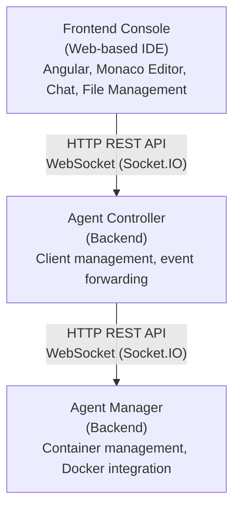

# Agenstra Documentation

Welcome to the documentation for **Agenstra**, the ForePath control plane for managing distributed AI agent infrastructure.

## What is Agenstra?

Agenstra lets operators manage remote agent-manager instances and interact with agents from one console:

- **Multiple agent-manager clients** connected and controlled from a single console
- **Real-time AI chat** over WebSocket with bidirectional agent communication
- **Integrated code editor** (Monaco) for files inside agent containers
- **Automated server provisioning** on Hetzner Cloud and DigitalOcean with Docker and agent-manager setup
- **Version control** (status, branches, commit, push, pull, rebase) from the web UI
- **Container management** for lifecycle, logs, and health
- **VNC browser access** with XFCE4 desktop and Chromium via noVNC

## Documentation Structure

### [Getting Started](./getting-started.md)

Prerequisites, installation, first client and agent, and a short feature tour.

### [Architecture](./architecture/README.md)

- [System Overview](./architecture/system-overview.md)
- [Components](./architecture/components.md)
- [Data Flow](./architecture/data-flow.md)

### [Applications](./applications/README.md)

- [Backend Agent Controller](./applications/backend-agent-controller.md)
- [Backend Agent Manager](./applications/backend-agent-manager.md)
- [Frontend Agent Console](./applications/frontend-agent-console.md)

### [Features](./features/README.md)

Product capabilities including clients, agents, provisioning, WebSockets, files, Git, Web IDE, chat, VNC, authentication, tickets, and plugins.

### [Deployment](./deployment/README.md)

- [Local Development](./deployment/local-development.md)
- [Docker Deployment](./deployment/docker-deployment.md)
- [System Requirements](./deployment/system-requirements.md)
- [Environment Configuration](./deployment/environment-configuration.md)
- [Production Checklist](./deployment/production-checklist.md)
- [Operator Runbook](./deployment/operator-runbook.md)
- [Background Jobs](./deployment/background-jobs.md)

### [Security](./security/README.md)

Compliance-oriented transparency, accepted-risk register, vulnerability reporting, SBOM artifacts, and CI scanning.

### [API Reference](./api-reference/README.md)

Agent Controller and Agent Manager HTTP OpenAPI and WebSocket AsyncAPI specifications.

### [AI Agents](./ai-agents/README.md)

AI coding assistant guides for Agenstra: workspace `.agenstra` context (rules, commands, skills, agents, MCP, agentctx, knowledge graph) plus project orientation.

### [Troubleshooting](./troubleshooting/README.md)

- [Common Issues](./troubleshooting/common-issues.md)
- [Debugging Guide](./troubleshooting/debugging-guide.md)

## Quick Start

New to Agenstra? Follow this path:

1. **[Getting Started](./getting-started.md)** for local setup
2. **[System Overview](./architecture/system-overview.md)** for architecture
3. **[Client Management](./features/client-management.md)** to connect an agent-manager
4. **[Environment Configuration](./deployment/environment-configuration.md)** before production

## System Architecture

Agenstra follows a three-tier architecture:

For detailed architecture information, see the [Architecture Documentation](./architecture/README.md).

## External Resources

- [Nx Documentation](https://nx.dev)
- [NestJS Documentation](https://nestjs.com)
- [Angular Documentation](https://angular.io)
- [Socket.IO Documentation](https://socket.io)
- [Monaco Editor](https://microsoft.github.io/monaco-editor/)

---

_For repository-wide security contact and supported versions, see the root `SECURITY.md` file in the GitHub repository._
