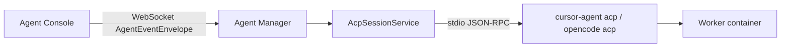

# Agent Client Protocol (ACP) in Agenstra

Agenstra’s agent manager uses the [Agent Client Protocol](https://agentclientprotocol.com) as the **internal transport** between the platform (ACP client) and coding agents running in worker containers (ACP agents).

## Glossary

| Term             | Meaning                                                                |
| ---------------- | ---------------------------------------------------------------------- |
| **ACP (client)** | Agent Client Protocol — JSON-RPC over stdio (this document)            |
| **MCP**          | Model Context Protocol — tools and resources for LLM hosts             |
| **BeeAI ACP**    | IBM Agent Communication Protocol — REST agent-to-agent (not used here) |

## Architecture

Outward APIs (OpenAPI / AsyncAPI chat events) are unchanged. ACP replaces vendor-specific CLI NDJSON parsing inside providers.

Built-in providers:

- **`cursor`** — launches `cursor-agent acp` in the worker container
- **`opencode`** — launches `opencode acp` in the worker container

## Protocol details

- **Version:** ACP protocol version 1 (stable)
- **Transport:** newline-delimited JSON-RPC 2.0 over stdio
- **Session flow:** `initialize` → `session/new` (or `session/load` with a persisted agent-issued id) → `session/prompt` → `session/update` notifications
- **Session resume:** ACP session ids are stored per agent on `acp_sessions` (jsonb), keyed by `resumeSessionSuffix` (empty key = primary chat). After an API restart, the manager opens a new stdio transport and calls `session/load` when the container id still matches. That covers main chat and background automation sessions (`-ticket-auto-loop`, `-ticket-auto-pre`, etc.) the same way in-memory reuse already did within a process.
- **Permissions:** `session/request_permission` is auto-approved when `ACP_AUTO_APPROVE` is not `false` (default for headless agents)

## Configuration

| Variable           | Values           | Default                  |
| ------------------ | ---------------- | ------------------------ |
| `ACP_AUTO_APPROVE` | `true` / `false` | `true` (headless agents) |

## Profile / config surface

Provider capabilities (including `transport: 'acp'`) are returned on:

- Manager `GET /api/config` → `agentTypes[].capabilities`
- Agent response DTOs → `capabilities`
- Controller client profile → `config.agentTypes` (embedded manager config)

## Notifications

Operator-facing notification events (controller notification bus / webhooks):

| Event                         | When                                              |
| ----------------------------- | ------------------------------------------------- |
| `agent.acp.session_failed`    | ACP initialize / session / transport failure      |
| `agent.acp.permission_denied` | Permission request denied or no options available |
| `agent.chat.failed`           | Generic chat turn failure                         |

Streaming token deltas are not notified.

## Worker image requirements

The [worker image](../../../apps/agenstra/backend-agent-manager/Dockerfile.worker) installs Cursor CLI and OpenCode so the manager can exec:

- `cursor-agent acp`
- `opencode acp`

## Troubleshooting

- **Session fails at initialize** — Confirm the agent binary supports `acp` inside the container (`docker exec … cursor-agent acp` / `opencode acp`).
- **Permission prompts** — Set `ACP_AUTO_APPROVE=false` only if the console will answer `session/request_permission`.
- **Auth errors** — Check Cursor/OpenCode credentials inside the worker container; stderr is logged as ACP exec stderr.

## Migration note

Legacy OpenClaw (`openclaw` agent type / AGI image) has been removed. Recreate affected agents as `cursor` or `opencode`.
