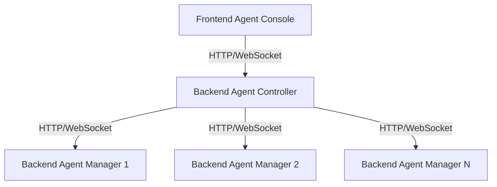

# Applications Documentation

This section provides detailed documentation for each application in the Agenstra system.

## Overview

Agenstra consists of three main applications:

1. **Backend Agent Controller** - Centralized control plane for managing multiple agent-manager instances
2. **Backend Agent Manager** - Agent management system with HTTP REST API and WebSocket gateway
3. **Frontend Agent Console** - Web-based IDE and chat interface for interacting with agents

## Applications

### [Backend Agent Controller](./backend-agent-controller.md)

Centralized control plane that enables you to manage multiple distributed agent-manager instances from a single console.

**Key Features**:

- Client management (CRUD operations)
- Proxied agent operations
- WebSocket event forwarding
- Server provisioning (Hetzner, DigitalOcean)
- Authentication (Keycloak or API key)

**Ports**:

- HTTP API: `3100` (default)
- WebSocket: `8081` (default)

### [Backend Agent Manager](./backend-agent-manager.md)

Agent management system that handles agent lifecycle, container management, and real-time communication.

**Key Features**:

- Agent management (CRUD operations)
- Container management (Docker)
- WebSocket gateway for agent communication
- File system operations
- Version control operations (Git)
- Plugin-based agent provider system

**Ports**:

- HTTP API: `3000` (default)
- WebSocket: `8080` (default)

### [Frontend Agent Console](./frontend-agent-console.md)

Web-based IDE and chat interface built with Angular and NgRx.

**Key Features**:

- Chat interface for AI agents
- Monaco Editor for code editing
- File system browser
- Git operations UI
- Container statistics
- Real-time updates via WebSocket

**Ports**:

- Development: `4200` (default)
- Production: Configurable

## Application Relationships

## Communication Patterns

- **Frontend ↔ Controller**: HTTP REST API and WebSocket for real-time events
- **Controller ↔ Manager**: HTTP REST API (proxied) and WebSocket (event forwarding)
- **Manager ↔ Agent Containers**: Docker API and container stdin/stdout

## Related Documentation

- **[Architecture Overview](../architecture/system-overview.md)** - System architecture
- **[Getting Started](../getting-started.md)** - Setup and configuration
- **[Deployment Guide](../deployment/README.md)** - Deployment documentation
- **[Features Documentation](../features/README.md)** - Feature details

---

_For detailed application-specific information, see the individual application documentation pages._
