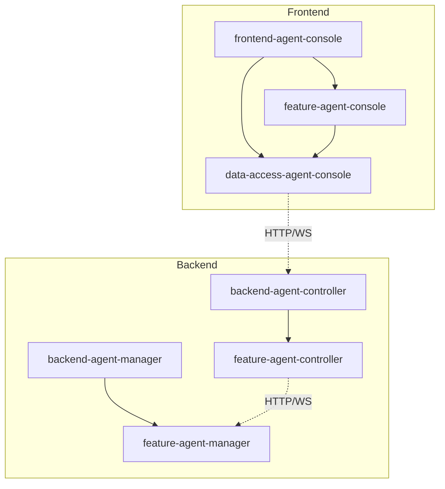

# Components

This document provides a detailed breakdown of all system components, their responsibilities, and relationships.

## Backend Applications

### Backend Agent Controller

**Location**: `apps/backend-agent-controller`

**Purpose**: Centralized control plane for managing multiple distributed agent-manager instances.

**Key Components**:

- `ClientsController` - HTTP REST API for client management
- `ClientsService` - Business logic for clients
- `ClientsGateway` - WebSocket gateway for event forwarding
- `ClientAgentProxyService` - Proxies HTTP requests to remote agent-managers
- `ProvisioningService` - Automated cloud server provisioning

**Dependencies**:

- `@forepath/framework/backend/feature-agent-controller` - Core library
- PostgreSQL database
- Keycloak (optional, can use API key)

**Ports**:

- HTTP API: `3100` (default)
- WebSocket: `8081` (default)

**Documentation**: [Backend Agent Controller Application](../applications/backend-agent-controller.md)

### Backend Agent Manager

**Location**: `apps/backend-agent-manager`

**Purpose**: Agent management system with HTTP REST API and WebSocket gateway.

**Key Components**:

- `AgentsController` - HTTP REST API for agent management
- `AgentsService` - Business logic for agents
- `AgentsGateway` - WebSocket gateway for agent communication
- `DockerService` - Container management and log streaming
- `AgentProviderFactory` - Plugin-based agent provider system

**Dependencies**:

- `@forepath/framework/backend/feature-agent-manager` - Core library
- PostgreSQL database
- Docker (for container management)
- Keycloak (optional, can use API key)

**Ports**:

- HTTP API: `3000` (default)
- WebSocket: `8080` (default)

**Documentation**: [Backend Agent Manager Application](../applications/backend-agent-manager.md)

## Frontend Applications

### Frontend Agent Console

**Location**: `apps/frontend-agent-console`

**Purpose**: Web-based IDE and chat interface for interacting with agents.

**Key Components**:

- `AgentConsoleChatComponent` - Main chat interface
- `AgentConsoleContainerComponent` - Container component with routing
- `AgentConsoleLoginComponent` - Login page
- Monaco Editor integration
- NgRx state management

**Dependencies**:

- `@forepath/framework/frontend/feature-agent-console` - Feature components
- `@forepath/framework/frontend/data-access-agent-console` - State management
- Angular framework
- NgRx store

**Ports**:

- Development: `4200` (default)
- Production: Configurable

**Documentation**: [Frontend Agent Console Application](../applications/frontend-agent-console.md)

## Backend Libraries

### Feature Agent Controller

**Location**: `libs/domains/framework/backend/feature-agent-controller`

**Purpose**: Client management and proxying functionality.

**Key Components**:

- `ClientEntity` - Client domain model
- `ClientAgentCredentialEntity` - Agent credential storage
- `ClientsRepository` - Data access layer
- `ClientsService` - Business logic
- `ClientAgentProxyService` - HTTP request proxying
- `ClientsGateway` - WebSocket event forwarding
- `ProvisioningService` - Server provisioning (Hetzner, DigitalOcean)

**Documentation**: [Agent Controller Library README](../../../libs/domains/framework/backend/feature-agent-controller/README.md)

### Feature Agent Manager

**Location**: `libs/domains/framework/backend/feature-agent-manager`

**Purpose**: Agent management core functionality.

**Key Components**:

- `AgentEntity` - Agent domain model
- `AgentsRepository` - Data access layer
- `AgentsService` - Business logic
- `AgentsGateway` - WebSocket gateway
- `DockerService` - Container management
- `AgentProvider` - Plugin interface for agent providers
- `CursorAgentProvider` - Cursor-agent implementation

**Documentation**: [Agent Manager Library README](../../../libs/domains/framework/backend/feature-agent-manager/README.md)

## Frontend Libraries

### Feature Agent Console

**Location**: `libs/domains/framework/frontend/feature-agent-console`

**Purpose**: Frontend feature components and UI.

**Key Components**:

- `AgentConsoleChatComponent` - Chat interface component
- `AgentConsoleContainerComponent` - Container component
- `AgentConsoleLoginComponent` - Login component
- `FileEditorComponent` - Monaco Editor integration
- Route definitions

**Documentation**: [Frontend Feature Library README](../../../libs/domains/framework/frontend/feature-agent-console/README.md)

### Data Access Agent Console

**Location**: `libs/domains/framework/frontend/data-access-agent-console`

**Purpose**: State management (NgRx) and data access.

**Key Components**:

- **State Slices**:
  - `clients` - Client state management
  - `agents` - Agent state management
  - `sockets` - WebSocket connection state
  - `files` - File system state
  - `vcs` - Version control state
  - `authentication` - Authentication state
  - `stats` - Container statistics state
- **Facades**:
  - `ClientsFacade` - Client operations
  - `AgentsFacade` - Agent operations
  - `SocketsFacade` - WebSocket operations
  - `FilesFacade` - File operations
  - `VcsFacade` - Git operations
- **Effects**: NgRx effects for side effects
- **Selectors**: State selectors

**Documentation**: [Frontend Data Access Library README](../../../libs/domains/framework/frontend/data-access-agent-console/README.md)

## Component Dependencies

## Database Schema

### Agent Controller Database

**Tables**:

- `clients` - Client entities (remote agent-manager instances)
- `client_agent_credentials` - Stored agent credentials for auto-login
- `provisioning_references` - Links clients to provisioned cloud servers

### Agent Manager Database

**Tables**:

- `agents` - Agent entities with container information
- `agent_chat_messages` - Chat message history (if implemented)

## External Dependencies

### Infrastructure

- **PostgreSQL** - Database for both controller and manager
- **Docker** - Container runtime for agent execution
- **Keycloak** - Identity and access management (optional)

### Cloud Providers

- **Hetzner Cloud** - Server provisioning provider
- **DigitalOcean** - Server provisioning provider

## Component Communication

### HTTP REST API

- Frontend → Agent Controller: Client management, proxied agent operations
- Agent Controller → Agent Manager: Proxied HTTP requests

### WebSocket

- Frontend ↔ Agent Controller: Event forwarding, client context
- Agent Controller ↔ Agent Manager: Event forwarding, agent communication

### Database

- Agent Controller: Client and credential storage
- Agent Manager: Agent and chat history storage

## Related Documentation

- **[System Overview](./system-overview.md)** - High-level architecture
- **[Data Flow](./data-flow.md)** - Communication patterns
- **[Backend Agent Controller Application](../applications/backend-agent-controller.md)** - Application details
- **[Backend Agent Manager Application](../applications/backend-agent-manager.md)** - Application details
- **[Frontend Agent Console Application](../applications/frontend-agent-console.md)** - Application details

---

_For implementation details, see the respective library and application README files._
