# Data Flow

This document describes the communication patterns and data flow throughout the Agenstra system.

## HTTP REST API Flow

### Client Management Flow

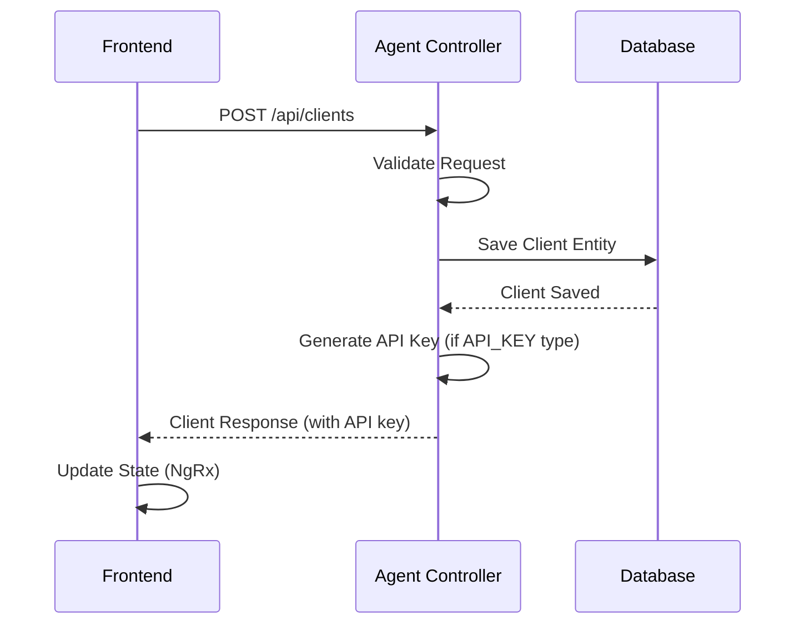

### Proxied Agent Creation Flow

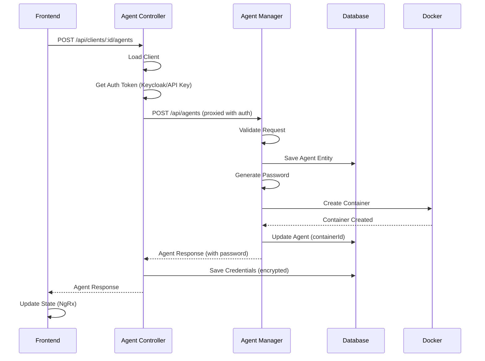

### File Operation Flow

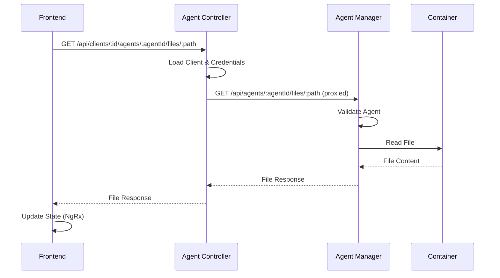

## WebSocket Event Flow

### Connection and Authentication Flow

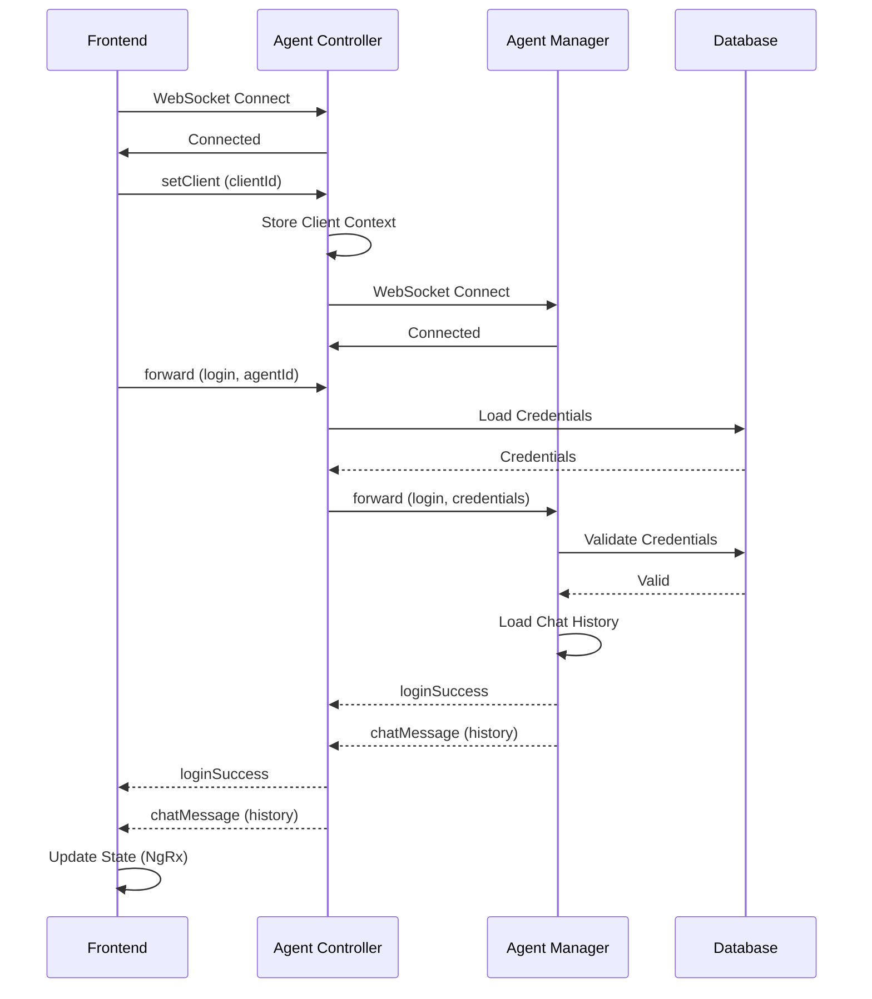

### Chat Message Flow

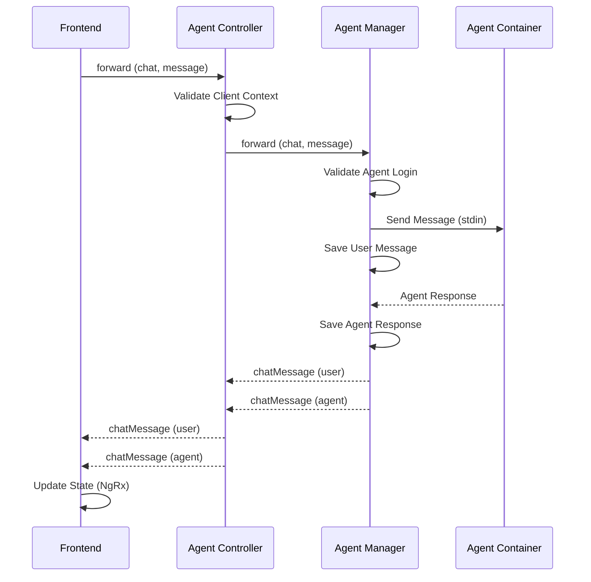

### Reconnection Flow

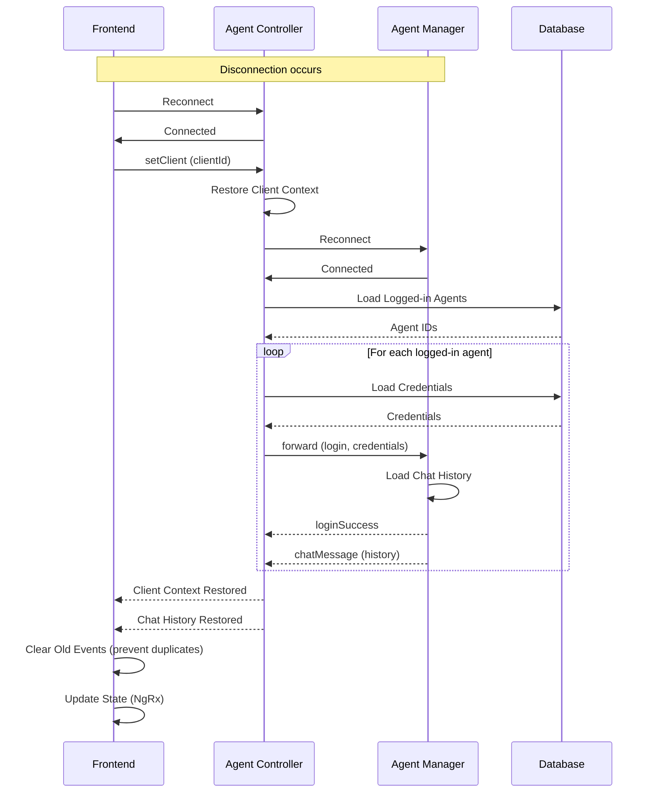

## State Management Flow (NgRx)

### Action → Effect → Service → Reducer Flow

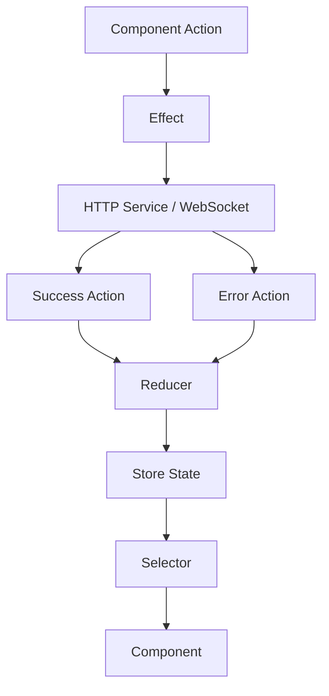

### Example: Loading Clients

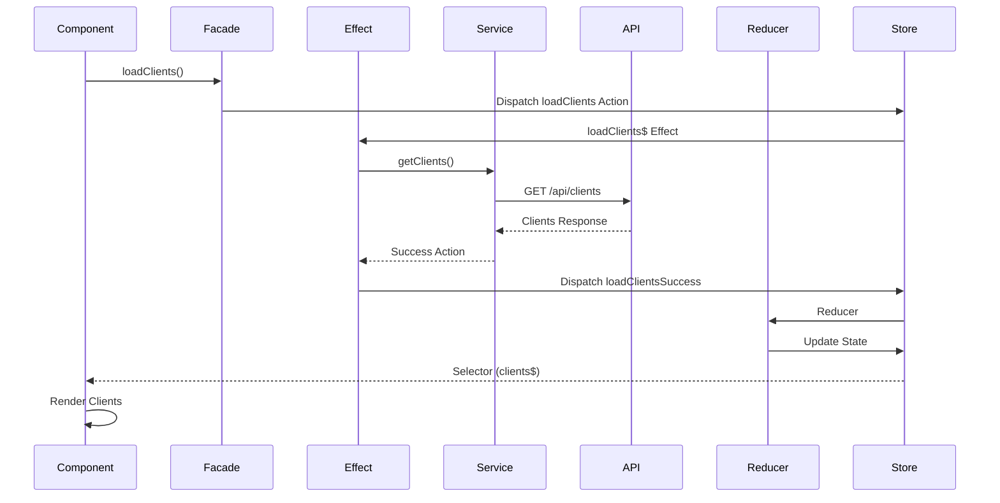

## File System Operations Flow

### Reading a File

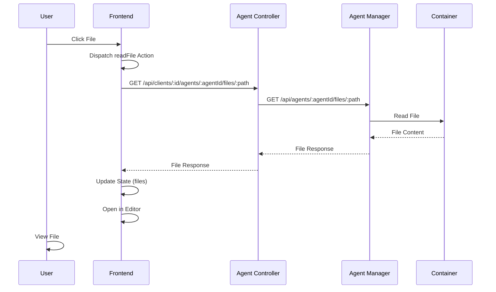

### Writing a File

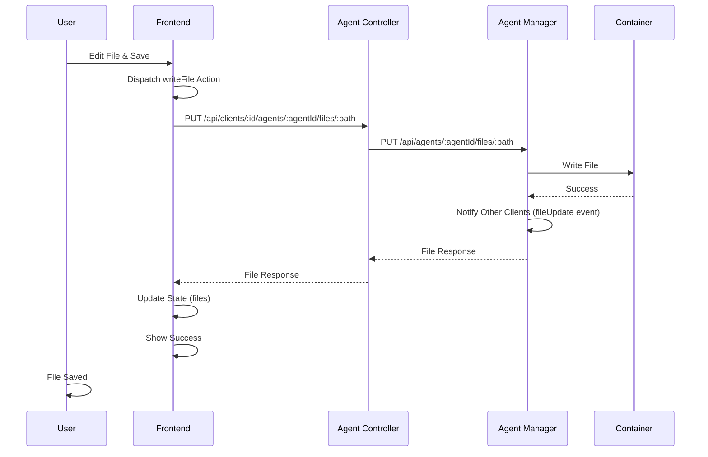

## Version Control Operations Flow

### Git Status Flow

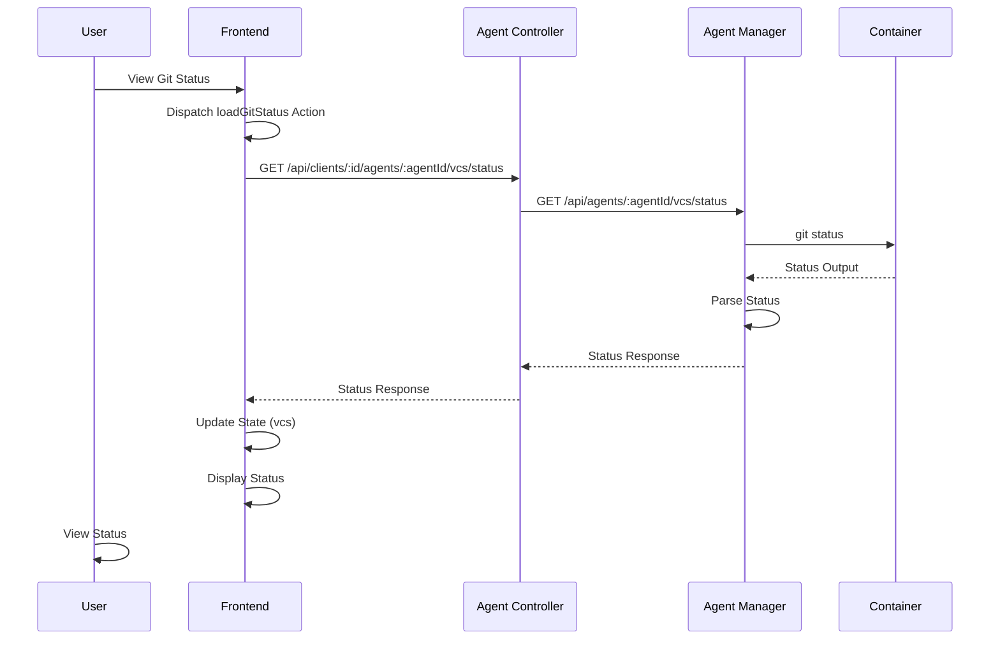

### Commit Flow

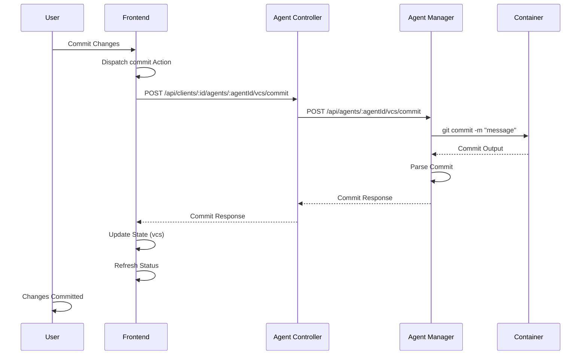

## Server Provisioning Flow

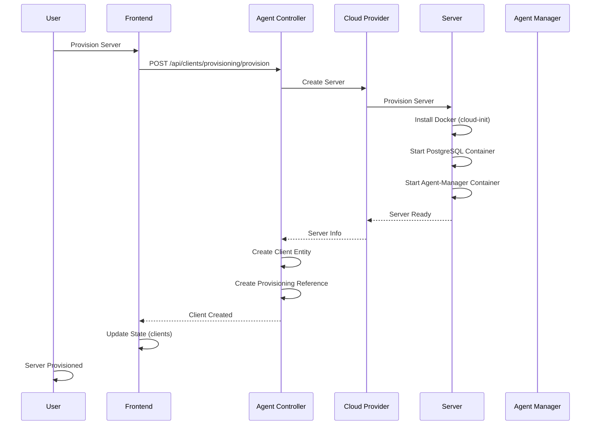

## Related Documentation

- **[System Overview](./system-overview.md)** - High-level architecture
- **[Components](./components.md)** - Component breakdown
- **[WebSocket Communication](../features/websocket-communication.md)** - Real-time communication details
- **[Client Management](../features/client-management.md)** - Client operations
- **[Agent Management](../features/agent-management.md)** - Agent operations
- **[Sequence Diagrams](../../../libs/domains/framework/backend/feature-agent-controller/docs/)** - Detailed sequence diagrams

---

_For implementation details, see the [library documentation](../../../libs/domains/framework/backend/feature-agent-controller/README.md)._
