# System Overview

This document provides a high-level overview of the Agenstra system architecture, component relationships, and communication patterns.

## Three-Tier Architecture

Agenstra follows a three-tier distributed architecture:

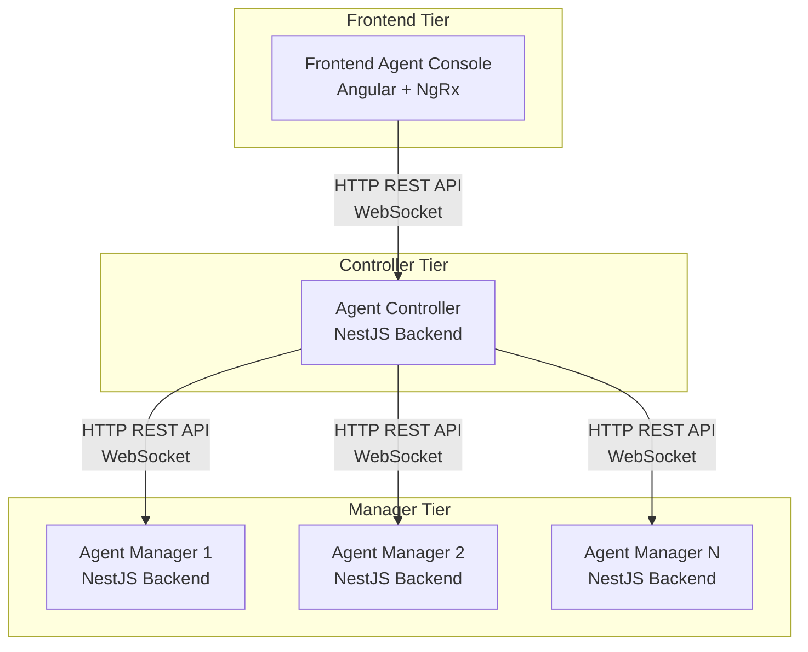

### Tier Responsibilities

#### Frontend Tier

- **User Interface** - Web-based IDE with Monaco Editor
- **State Management** - NgRx for application state
- **Real-time Communication** - WebSocket client for chat and events
- **File Management** - File system operations UI
- **Version Control** - Git operations UI

#### Controller Tier

- **Client Management** - CRUD operations for clients (remote agent-manager instances)
- **Event Forwarding** - Forward WebSocket events between frontend and managers
- **Authentication** - Keycloak or API key authentication
- **Credential Management** - Store and manage agent credentials
- **Server Provisioning** - Automated cloud server provisioning

#### Manager Tier

- **Agent Management** - CRUD operations for agents
- **Container Management** - Docker container lifecycle
- **WebSocket Gateway** - Real-time communication with agents
- **File Operations** - File system operations in containers
- **Version Control** - Git operations in containers

## Component Relationships

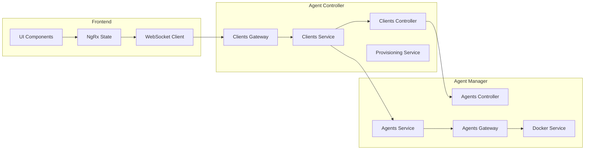

## Communication Patterns

### HTTP REST API Flow

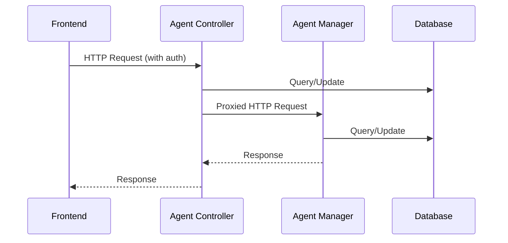

### WebSocket Event Flow

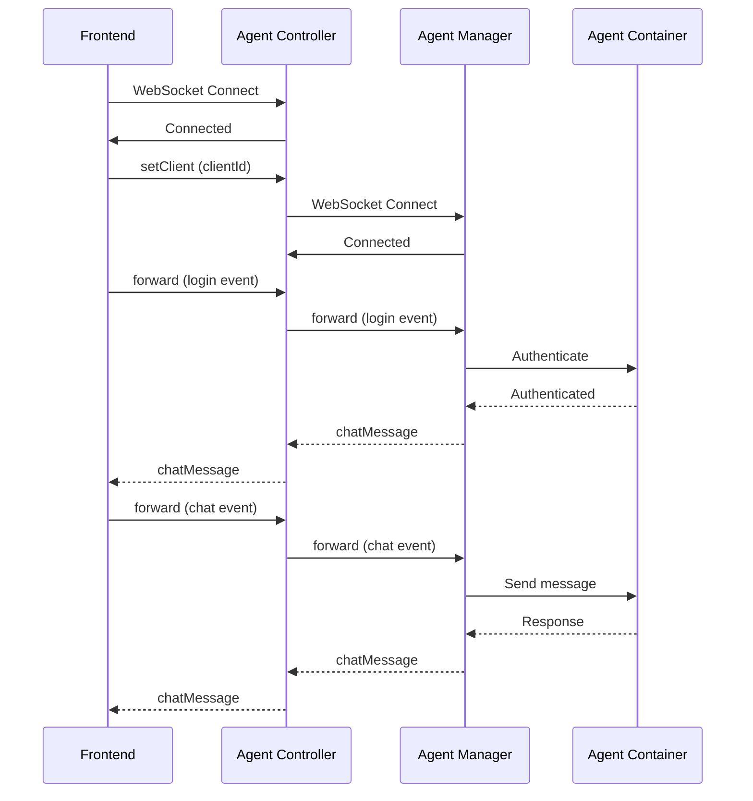

## Data Flow

### Client Creation Flow

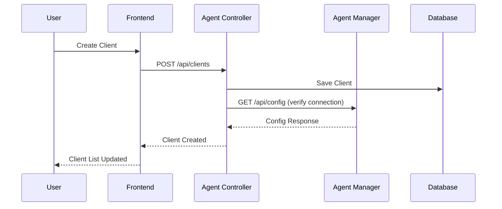

### Agent Creation Flow

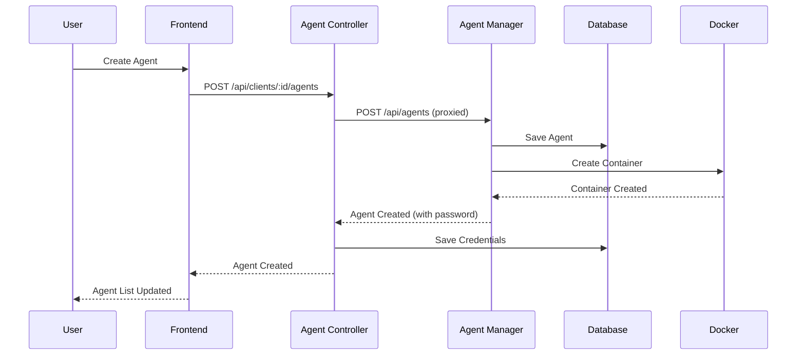

## Authentication Flow

### HTTP Authentication

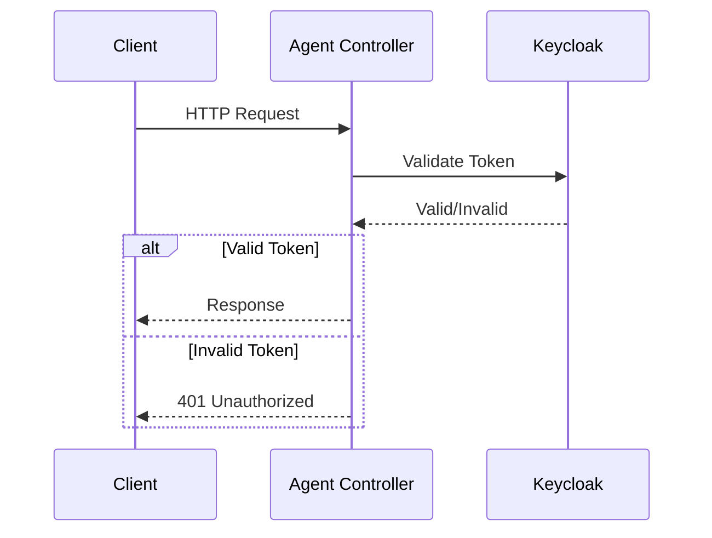

### WebSocket Authentication (Agent)

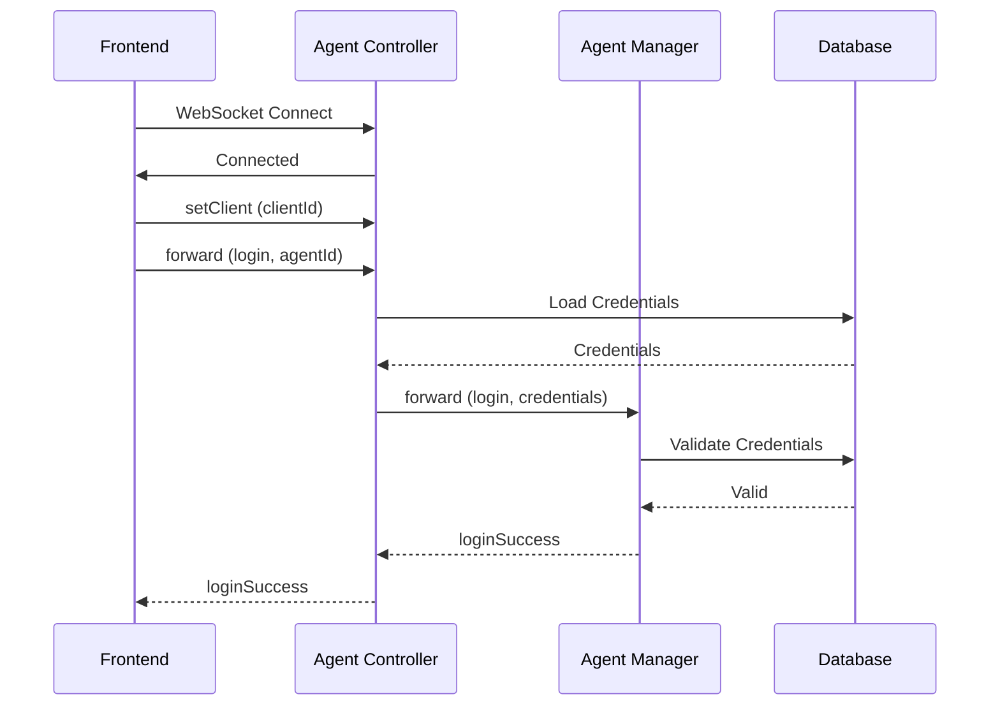

## State Management

### Frontend State (NgRx)

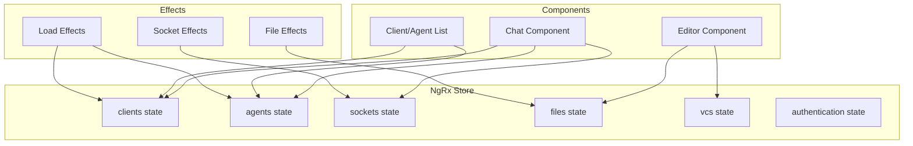

## Reconnection Handling

### Frontend Reconnection

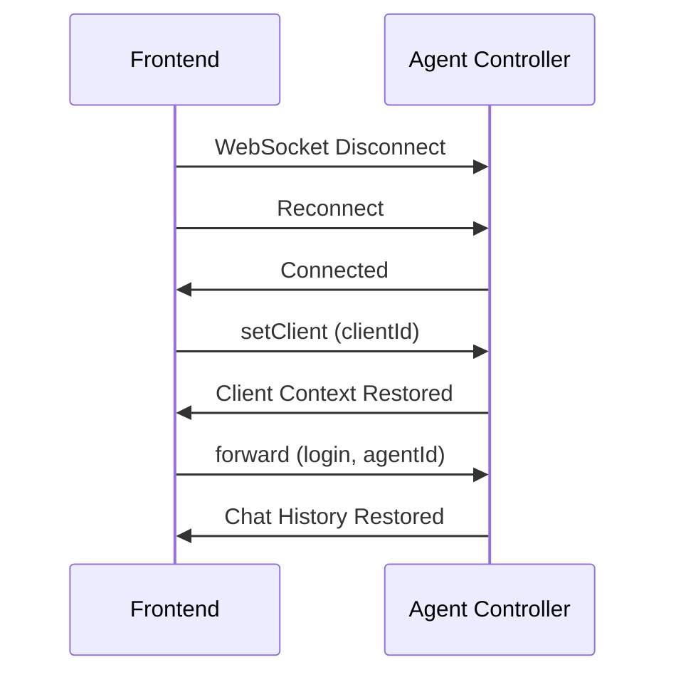

### Controller-to-Manager Reconnection

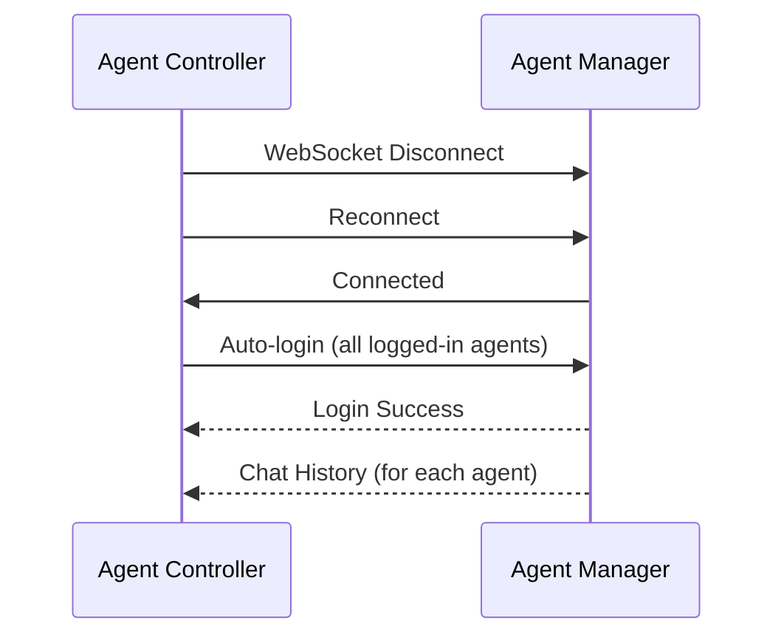

## Related Documentation

- **[Components](./components.md)** - Detailed component breakdown
- **[Data Flow](./data-flow.md)** - Detailed data flow patterns
- **[Agent Controller Library](../../../libs/domains/framework/backend/feature-agent-controller/docs/overview.mmd)** - Visual overview diagram
- **[Agent Manager Library](../../../libs/domains/framework/backend/feature-agent-manager/docs/overview.mmd)** - Visual overview diagram
- **[Lifecycle Diagrams](../../../libs/domains/framework/backend/feature-agent-controller/docs/lifecycle.mmd)** - End-to-end sequence diagrams

---

_For implementation details, see the [library documentation](../../../libs/domains/framework/backend/feature-agent-controller/README.md) and [application documentation](../applications/backend-agent-controller.md)._
