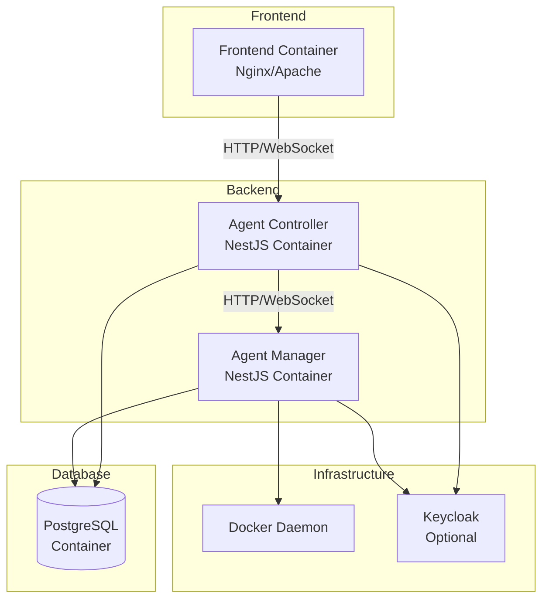

# Deployment Documentation

This section provides comprehensive deployment guides and configuration information for the Agenstra system.

## Overview

Agenstra can be deployed in various ways:

- **Local Development** - For development and testing
- **Docker Deployment** - Containerized deployment using Docker Compose
- **Production Deployment** - Production-ready deployment with security and performance considerations

## Deployment Guides

### [Local Development](./local-development.md)

Setting up Agenstra for local development:

- Prerequisites and installation
- Local database setup
- Running applications locally
- Development workflow
- Testing locally

### [Docker Deployment](./docker-deployment.md)

Containerized deployment using Docker:

- Docker Compose setup
- Container configuration
- Volume management
- Network configuration
- Multi-container orchestration

### [Production Checklist](./production-checklist.md)

Production deployment guide:

- Pre-deployment checklist
- Security considerations
- Performance optimization
- Monitoring setup
- Backup strategies

### [Environment Configuration](./environment-configuration.md)

Complete environment variables reference:

- Application-specific variables
- Database configuration
- Authentication configuration
- CORS and rate limiting
- Server provisioning

## Deployment Architecture



## Quick Start

### Docker Compose (Recommended)

```bash
# Start all services
cd apps/backend-agent-controller
docker compose up -d

cd ../backend-agent-manager
docker compose up -d

cd ../frontend-agent-console
docker compose up -d
```

### Local Development

```bash
# Install dependencies
npm install

# Start services
nx serve backend-agent-controller
nx serve backend-agent-manager
nx serve frontend-agent-console
```

## Related Documentation

- **[Getting Started](../getting-started.md)** - Quick start guide
- **[Architecture](../architecture/README.md)** - System architecture
- **[Applications](../applications/README.md)** - Application details

---

_For detailed deployment information, see the individual deployment guides._
