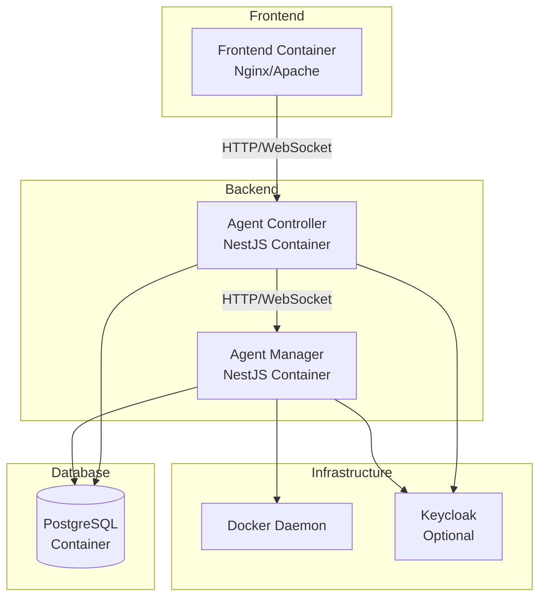

# Deployment Documentation

This section provides deployment guides and configuration information for Agenstra.

## Overview

Agenstra can be deployed in various ways:

- **Local Development**: For development and testing
- **Docker Deployment**: Containerized deployment using Docker Compose
- **Production Deployment**: Production-ready deployment with security and performance considerations

## Deployment Guides

### [Local Development](./local-development.md)

Setting up Agenstra for local development:

- Prerequisites and installation
- Local database setup
- Running applications locally
- Development workflow
- Testing locally

### [Docker Deployment](./docker-deployment.md)

Containerized deployment using Docker:

- Docker Compose setup
- Container configuration and image hardening (non-root users, runtime secrets, Docker socket GID)
- Volume management
- Network configuration
- Multi-container orchestration

### [System Requirements](./system-requirements.md)

CPU, memory, and disk guidance by deployment role:

- Controller API, worker, and scheduler sizing
- Manager host and per-agent workload containers (worker, VNC, SSH, AGI)
- PostgreSQL (pgvector) and Redis baselines
- Frontend hosts and mixed local-development hosts

### [Environment Configuration](./environment-configuration.md)

Complete environment variables reference:

- Application-specific variables
- Database configuration
- Authentication configuration
- CORS and rate limiting
- Server provisioning
- [Dynamic provider plugins](../features/dynamic-provider-plugins.md): optional runtime extensions for Agenstra backends

### [Production Checklist](./production-checklist.md)

Production deployment guide:

- Pre-deployment checklist
- Security considerations
- Performance optimization
- Monitoring setup
- Backup strategies

### [Operator Runbook](./operator-runbook.md)

Install and day-2 ops checklists:

- Capacity verification against system requirements
- Install verification and smoke checks
- Ongoing operations (queues, backups, logging)
- Disclosure, SBOM, and supported-version obligations

### [Background Jobs](./background-jobs.md)

BullMQ background processing for the agent controller:

- Queue roles (API, scheduler, worker)
- Job registry and coordinator schedules
- Redis and worker concurrency notes

## Deployment Architecture


```mermaid
graph TB
    subgraph "Frontend"
        FE[Frontend Container<br/>Nginx/Apache]
    end

    subgraph "Backend"
        AC[Agent Controller<br/>NestJS Container]
        AM[Agent Manager<br/>NestJS Container]
    end

    subgraph "Database"
        DB[(PostgreSQL<br/>Container)]
    end

    subgraph "Infrastructure"
        DOCKER[Docker Daemon]
        KEYCLOAK[Keycloak<br/>Optional]
    end

    FE -->|HTTP/WebSocket| AC
    AC -->|HTTP/WebSocket| AM
    AC --> DB
    AM --> DB
    AM --> DOCKER
    AC --> KEYCLOAK
    AM --> KEYCLOAK
```

## Quick Start

### Docker Compose (Recommended)

```bash
# Start all services
cd apps/agenstra/backend-agent-controller
docker compose up -d

cd ../backend-agent-manager
docker compose up -d

cd ../frontend-agent-console
docker compose up -d
```

### Local Development

```bash
# Install dependencies
npm install

# Start services
nx serve agenstra-backend-agent-controller
nx serve agenstra-backend-agent-manager
nx serve agenstra-frontend-agent-console
```

## Related Documentation

- **[Getting Started](../getting-started.md)**: Quick start guide
- **[Architecture](../architecture/README.md)**: System architecture
- **[Applications](../applications/README.md)**: Application details
- **[Security](../security/README.md)**: Accepted risks, hardening, SBOM, and disclosure

---

_For detailed deployment information, see the individual deployment guides._
