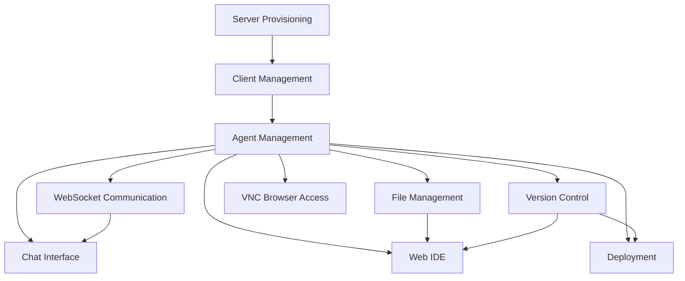

# Features Documentation

This section provides comprehensive documentation for all features in the Agenstra system.

## Overview

Agenstra provides a complete set of features for managing distributed AI agent infrastructure:

- **Client Management** - Manage multiple remote agent-manager instances
- **Agent Management** - Create, manage, and interact with AI agents
- **Server Provisioning** - Automated cloud server provisioning
- **WebSocket Communication** - Real-time bidirectional communication
- **File Management** - File system operations in agent containers
- **Version Control** - Git operations directly from the web interface
- **Web IDE** - Monaco Editor integration for code editing
- **Chat Interface** - AI chat functionality with real-time responses
- **VNC Browser Access** - Graphical browser access via VNC and noVNC
- **Deployment** - CI/CD pipeline management and deployment functionality

## Features

### [Client Management](./client-management.md)

Create and manage clients (remote agent-manager instances). Connect to existing agent-managers or provision new servers automatically.

**Key Capabilities**:

- Create, read, update, and delete clients
- Configure authentication (API key or Keycloak)
- View client configuration and available agent types
- Manage multiple agent-manager instances from one console

### [Agent Management](./agent-management.md)

Create and manage AI agents with full lifecycle support. Agents run in Docker containers and can be interacted with via chat and file operations.

**Key Capabilities**:

- Create, read, update, and delete agents
- Agent authentication and credential management
- Container lifecycle management
- Plugin-based agent provider system

### [Server Provisioning](./server-provisioning.md)

Automated cloud server provisioning with Docker and agent-manager deployment. Supports Hetzner Cloud and DigitalOcean.

**Key Capabilities**:

- Provision servers on Hetzner Cloud or DigitalOcean
- Automated Docker installation
- Automated agent-manager deployment
- Configure authentication, Git repositories, and agent settings

### [WebSocket Communication](./websocket-communication.md)

Real-time bidirectional communication between frontend, controller, and manager. Handles chat messages, events, and state synchronization.

**Key Capabilities**:

- Real-time chat with AI agents
- Event forwarding between components
- Automatic reconnection with state restoration
- Chat history restoration

### [File Management](./file-management.md)

File system operations in agent containers. Read, write, create, delete, and move files and directories.

**Key Capabilities**:

- Browse file system
- Read and edit files
- Create files and directories
- Delete and move files
- Real-time file updates

### [Version Control](./version-control.md)

Full Git operations directly from the web interface. View status, manage branches, commit, push, pull, and resolve conflicts.

**Key Capabilities**:

- View git status and branches
- Stage and unstage files
- Commit changes
- Push and pull from remote
- Rebase and switch branches
- Resolve merge conflicts

### [Web IDE](./web-ide.md)

Monaco Editor integration for code editing in agent containers. Syntax highlighting, code completion, and file management.

**Key Capabilities**:

- Syntax highlighting for multiple languages
- Code completion and IntelliSense
- File system browser
- Save and reload files
- Real-time file updates

### [Chat Interface](./chat-interface.md)

AI chat functionality with real-time responses. Send messages to agents and receive instant responses.

**Key Capabilities**:

- Send messages to agents
- Receive real-time responses
- View chat history
- Markdown rendering
- Automatic history restoration

### [VNC Browser Access](./vnc-browser-access.md)

Graphical browser access via VNC and noVNC. Access a Chromium browser running in a virtual workspace container associated with an agent.

**Key Capabilities**:

- VNC container with XFCE4 desktop environment
- Chromium browser auto-started on session login
- Secure VNC authentication with encrypted passwords
- Web-based noVNC client accessible via HTTPS
- Dedicated Docker network for container isolation
- Shared workspace volume between agent and VNC containers

### [Deployment](./deployment.md)

CI/CD pipeline management and deployment functionality. Configure CI/CD providers (GitHub Actions), trigger pipeline runs, monitor their status, and view logs directly from the Agenstra console.

**Key Capabilities**:

- Configure CI/CD providers (GitHub Actions)
- List repositories, branches, and workflows
- Trigger pipeline runs manually
- Monitor pipeline run status in real-time
- View pipeline run logs and individual job logs
- Track deployment history

## Feature Relationships

## Related Documentation

- **[Getting Started](../getting-started.md)** - Quick start guide
- **[Architecture](../architecture/README.md)** - System architecture
- **[Applications](../applications/README.md)** - Application documentation
- **[Deployment](../deployment/README.md)** - Deployment guides

---

_For detailed information about each feature, see the individual feature documentation pages._
