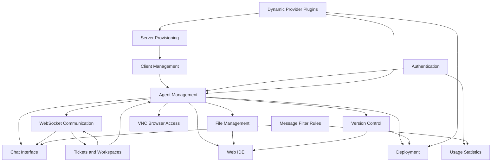

# Features Documentation

This section covers features in the Agenstra product.

## Overview

Agenstra covers distributed AI agent operations:

- **Client Management**: Manage multiple remote agent-manager instances
- **Agent Management**: Create, manage, and interact with AI agents
- **Server Provisioning**: Automated cloud server provisioning
- **WebSocket Communication**: Real-time bidirectional communication
- **File Management**: File system operations in agent containers
- **Version Control**: Git operations directly from the web interface
- **Web IDE**: Monaco Editor integration for code editing
- **Chat Interface**: AI chat functionality with real-time responses
- **VNC Browser Access**: Graphical browser access via VNC and noVNC
- **Deployment**: CI/CD pipeline management and deployment functionality
- **Authentication**: Multiple authentication methods with configurable user registration
- **Tickets and Workspaces**: Ticket boards, migration, and automation on the controller
- **Usage Statistics**: Controller-backed usage and filter metrics (distinct from container stats)
- **Message Filter Rules**: Global and per-agent regex policies for chat traffic
- **Atlassian import**: Admin-managed site connections and import configs (Jira and Confluence) into tickets and knowledge
- **Dynamic provider plugins**: Extend provisioning, agents, pipelines, context import, and chat filters via env-configured packages
- **OpenTelemetry**: Optional Prometheus metrics and OTLP export (disabled by default)

## Features

### [Client Management](./client-management.md)

Create and manage clients (remote agent-manager instances). Connect to existing agent-managers or provision new servers automatically.

**Key Capabilities**:

- Create, read, update, and delete clients
- Configure authentication (API key or Keycloak)
- Per-client permissions (keycloak/users mode): add and remove users with roles
- View client configuration and available agent types
- Manage multiple agent-manager instances from one console

### [Agent Management](./agent-management.md)

Create and manage AI agents with full lifecycle support. Agents run in Docker containers and can be interacted with via chat and file operations.

**Key Capabilities**:

- Create, read, update, and delete agents
- Agent authentication and credential management
- Container lifecycle management
- Plugin-based agent provider system

### [Server Provisioning](./server-provisioning.md)

Automated cloud server provisioning with Docker and agent-manager deployment. Supports Hetzner Cloud and DigitalOcean.

**Key Capabilities**:

- Provision servers on Hetzner Cloud or DigitalOcean
- Automated Docker installation
- Automated agent-manager deployment
- Configure authentication, Git repositories, and agent settings

### [WebSocket Communication](./websocket-communication.md)

Real-time bidirectional communication between frontend, controller, and manager. Handles chat messages, events, and state synchronization.

**Key Capabilities**:

- Real-time chat with AI agents
- Event forwarding between components
- Automatic reconnection with state restoration
- Chat history restoration

### [File Management](./file-management.md)

File system operations in agent containers. Read, write, create, delete, and move files and directories.

**Key Capabilities**:

- Browse file system
- Read and edit files
- Create files and directories
- Delete and move files
- Real-time file updates

### [Version Control](./version-control.md)

Full Git operations directly from the web interface. View status, manage branches, commit, push, pull, and resolve conflicts.

**Key Capabilities**:

- View git status and branches
- Stage and unstage files
- Commit changes
- Push and pull from remote
- Rebase and switch branches
- Resolve merge conflicts

### [Web IDE](./web-ide.md)

Monaco Editor integration for code editing in agent containers. Syntax highlighting, code completion, and file management.

**Key Capabilities**:

- Syntax highlighting for multiple languages
- Code completion and IntelliSense
- File system browser
- Save and reload files
- Real-time file updates

### [Chat Interface](./chat-interface.md)

AI chat functionality with real-time responses. Send messages to agents and receive instant responses.

**Key Capabilities**:

- Send messages to agents
- Receive real-time responses
- View chat history
- Markdown rendering
- Automatic history restoration

### [VNC Browser Access](./vnc-browser-access.md)

Graphical browser access via VNC and noVNC. Access a Chromium browser running in a virtual workspace container associated with an agent.

**Key Capabilities**:

- VNC container with XFCE4 desktop environment
- Chromium browser auto-started on session login
- Secure VNC authentication with encrypted passwords
- Web-based noVNC client accessible via HTTPS
- Dedicated Docker network for container isolation
- Shared workspace volume between agent and VNC containers

### [Deployment](./deployment.md)

CI/CD pipeline management and deployment functionality. Configure CI/CD providers (GitHub Actions), trigger pipeline runs, monitor their status, and view logs directly from the Agenstra console.

**Key Capabilities**:

- Configure CI/CD providers (GitHub Actions)
- List repositories, branches, and workflows
- Trigger pipeline runs manually
- Monitor pipeline run status in real-time
- View pipeline run logs and individual job logs
- Track deployment history

### [Authentication](./authentication.md)

Multiple authentication methods with configurable user registration. Support for API key, Keycloak OAuth2/OIDC, and built-in user authentication with optional signup disable.

**Key Capabilities**:

- API key authentication for simple deployments
- Keycloak OAuth2/OIDC for enterprise SSO
- Built-in user registration with email confirmation
- Password reset with 6-character alphanumeric codes
- Admin user management
- Optional signup disable for controlled onboarding

### [Webhooks](./webhooks.md)

Instance-scoped outbound webhook endpoints for controller events with optional workspace filters.

### [Email notifications](./email-notifications.md)

Queued identity emails (confirmation, password reset) via BullMQ.

### [Tickets and Workspaces](./tickets-and-workspaces.md)

Workspace-scoped tickets with collaboration, migration between clients, and ticket automation with realtime board updates.

**Key Capabilities**:

- Ticket CRUD, comments, and activity
- Workspace migration with coherent realtime rooms
- Automation configuration, approval, runs, and cancel
- Optional assisted body generation flows (see OpenAPI)

### [Usage Statistics](./usage-statistics.md)

Aggregated usage and filter metrics on the agent controller for reporting and operations.

**Key Capabilities**:

- Per-workspace and global summaries
- Chat I/O, filter drops, filter flags, and entity events
- Complements live **container** statistics from the agent-manager

### [Message Filter Rules](./message-filter-rules.md)

Regex-based rules at controller (global, admin) and manager (per-agent) levels.

**Key Capabilities**:

- Organization-wide policies synced from the controller
- Agent-specific tuning on each manager
- Metrics integration with usage statistics

### [Atlassian import](./atlassian-import.md)

Admin-only **Atlassian Cloud** integrations: store encrypted site credentials, define Jira or Confluence import scopes per workspace, run on a scheduler or on demand, and manage sync markers for idempotent imports.

**Key Capabilities**:

- Site connection CRUD and live connection test against Atlassian REST
- Import configuration CRUD with Jira or Confluence parameters and optional parent ticket or folder
- Scheduled and manual import runs with configurable batching and budgets
- Marker cleanup and optional marker release on ticket or knowledge delete
- Optional extra import providers via `DYNAMIC_CONTEXT_IMPORT_PROVIDERS` (see [Dynamic provider plugins](./dynamic-provider-plugins.md))

### [Dynamic provider plugins](./dynamic-provider-plugins.md)

Extend Agenstra backends with extra provider packages **without forking** the controller or manager images. Supports baked-in deploy-graph dependencies and post-build volume mounts with optional startup `npm install`.

**Key Capabilities**:

- Add cloud provisioning providers on the controller (`DYNAMIC_PROVISIONING_PROVIDERS`)
- Add agent backends, CI/CD providers, and chat filters on the manager
- Mount `./provider-plugins` or install from registry/tarballs at container startup
- Tiered fail-fast for critical provisioning registry (`DYNAMIC_PROVIDERS_FAIL_FAST`)

### [OpenTelemetry](./opentelemetry.md)

Optional Prometheus metrics scrape and OTLP export for the agent controller and agent manager. Disabled by default; requires `OTEL_ENABLED=true` and Basic auth credentials.

**Key Capabilities**:

- Kill switch via `OTEL_ENABLED`
- Prometheus exposition at `/otel/metrics` (outside `/api`)
- HTTP Basic auth for scrapers
- BullMQ queue job gauges on the controller
- Host and runtime metrics on both backends

## Feature Relationships

```mermaid
graph TB
    CM[Client Management]
    AM[Agent Management]
    SP[Server Provisioning]
    WS[WebSocket Communication]
    FM[File Management]
    VC[Version Control]
    IDE[Web IDE]
    Chat[Chat Interface]
    VNC[VNC Browser Access]
    DEP[Deployment]
    AUTH[Authentication]
    TK[Tickets and Workspaces]
    ST[Usage Statistics]
    FR[Message Filter Rules]
    DP[Dynamic Provider Plugins]

    SP --> CM
    CM --> AM
    AM --> WS
    AM --> FM
    AM --> VC
    AM --> IDE
    AM --> Chat
    AM --> VNC
    AM --> DEP
    WS --> Chat
    WS --> TK
    FM --> IDE
    VC --> IDE
    VC --> DEP
    AUTH --> AM
    AUTH --> ST
    TK --> WS
    FR --> Chat
    FR --> ST
    TK --> AM
    DP --> SP
    DP --> AM
    DP --> DEP
```

## Related Documentation

- **[Getting Started](../getting-started.md)**: Quick start guide
- **[Architecture](../architecture/README.md)**: System architecture
- **[Applications](../applications/README.md)**: Application documentation
- **[Deployment](../deployment/README.md)**: Deployment guides

---

_For detailed information about each feature, see the individual feature documentation pages._
