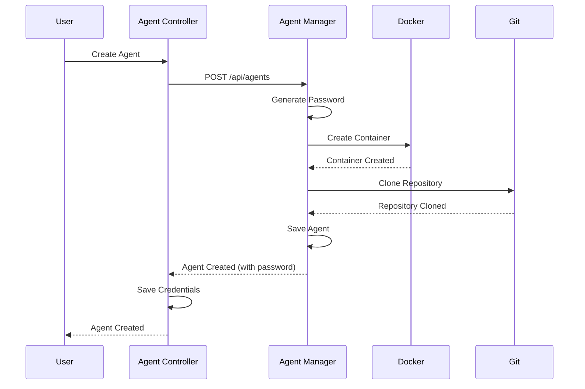

# Agent Management

Agent management enables you to create, manage, and interact with AI agents running in Docker containers.

## Overview

Agents are AI-powered entities that run in Docker containers. Each agent has:

- **Unique ID** (UUID)
- **Name** and optional description
- **Agent Type** (e.g., `cursor` for cursor-agent)
- **Container** - Docker container for agent execution
- **Credentials** - Password for WebSocket authentication
- **Workspace** - Git repository cloned into the container
- **VNC Container** (optional) - Virtual workspace with XFCE4 desktop and Chromium browser

## Creating an Agent

1. Select a client from the clients list
2. Click "Add Agent"
3. Fill in agent details:
   - **Name**: A descriptive name for the agent
   - **Description**: Optional description
   - **Agent Type**: Choose an agent type (e.g., `cursor`)
4. Click "Create"

The system will:

- Create the agent in the remote agent-manager
- Generate a secure password
- Create a Docker container for the agent
- Clone the Git repository (if configured) into the container
- Create a VNC container (if VNC support is enabled) with XFCE4 desktop and Chromium browser
- Create a Docker network connecting the agent and VNC containers
- Store credentials in the controller for automatic login
- Return the agent details including the password and VNC information

**Important**: Save the password! You'll need it to authenticate with the agent via WebSocket (though the system handles this automatically).

## Agent Lifecycle

### Creation



### Authentication

Agents authenticate via WebSocket using their UUID or name and password:

```typescript
socket.emit('login', {
  agentId: 'agent-uuid-or-name',
  password: 'agent-password',
});
```

The system automatically handles authentication when you select an agent in the frontend.

### Container Management

- **Container Creation**: Automatically created when agent is created
- **Container Lifecycle**: Managed by the agent-manager
- **Container Logs**: Streamed in real-time via WebSocket
- **Container Stats**: CPU, memory, and network statistics

### Deletion

When an agent is deleted:

1. The Docker container is stopped and removed
2. The agent entity is deleted from the database
3. Stored credentials are deleted from the controller
4. All associated data is removed

## Agent Types

Agenstra uses a plugin-based agent provider system. Each agent has an `agentType` field that determines which provider implementation is used.

### Available Types

- **`cursor`** (default) - Cursor-agent binary running in Docker containers

### Adding New Agent Types

To add a new agent type, implement the `AgentProvider` interface:

1. Create a provider class implementing `AgentProvider`
2. Register the provider in `AgentsModule`
3. Update DTO validation to include the new type

See the [Agent Manager Library](../../../libs/domains/framework/backend/feature-agent-manager/README.md#agent-provider-plugin-system) for details.

## Agent Operations

### View Agents

- List all agents for a client
- View agent details including container status
- See agent type and configuration

### Update Agent

1. Select an agent from the list
2. Click "Update Agent"
3. Modify agent details (name, description, agent type)
4. Click "Save"

**Note**: Changing the agent type may require container recreation.

### Delete Agent

1. Select an agent from the list
2. Click "Delete Agent"
3. Confirm deletion

**Warning**: This will delete the agent, stop and remove the container, and delete all associated data.

## Container Interaction

### Chat

Send messages to agents via the chat interface. Messages are sent to the container's stdin and responses are captured from stdout.

### File Operations

Read, write, create, and delete files in the agent container's workspace.

### Version Control

Perform Git operations (status, branches, commit, push, pull) in the agent container's workspace.

### Container Logs

View real-time container logs via WebSocket. Logs are streamed as they are generated.

### Container Statistics

Monitor container resource usage:

- CPU usage
- Memory usage
- Network I/O

## API Endpoints

### Agent Management

- `GET /api/clients/:id/agents` - List all agents for a client
- `GET /api/clients/:id/agents/:agentId` - Get a single agent by UUID
- `POST /api/clients/:id/agents` - Create a new agent
- `POST /api/clients/:id/agents/:agentId` - Update an existing agent
- `DELETE /api/clients/:id/agents/:agentId` - Delete an agent

For detailed API documentation, see the [Agent Controller Library](../../../libs/domains/framework/backend/feature-agent-controller/README.md#api-endpoints) and [Agent Manager Library](../../../libs/domains/framework/backend/feature-agent-manager/README.md#api-endpoints).

## Related Documentation

- **[Chat Interface](./chat-interface.md)** - Chat with agents
- **[File Management](./file-management.md)** - File operations in containers
- **[Version Control](./version-control.md)** - Git operations in containers
- **[WebSocket Communication](./websocket-communication.md)** - Real-time communication
- **[VNC Browser Access](./vnc-browser-access.md)** - Graphical browser access via VNC
- **[Backend Agent Manager Application](../applications/backend-agent-manager.md)** - Application details

---

_For detailed agent lifecycle information, see the [lifecycle diagrams](../../../libs/domains/framework/backend/feature-agent-manager/docs/lifecycle.mmd)._
