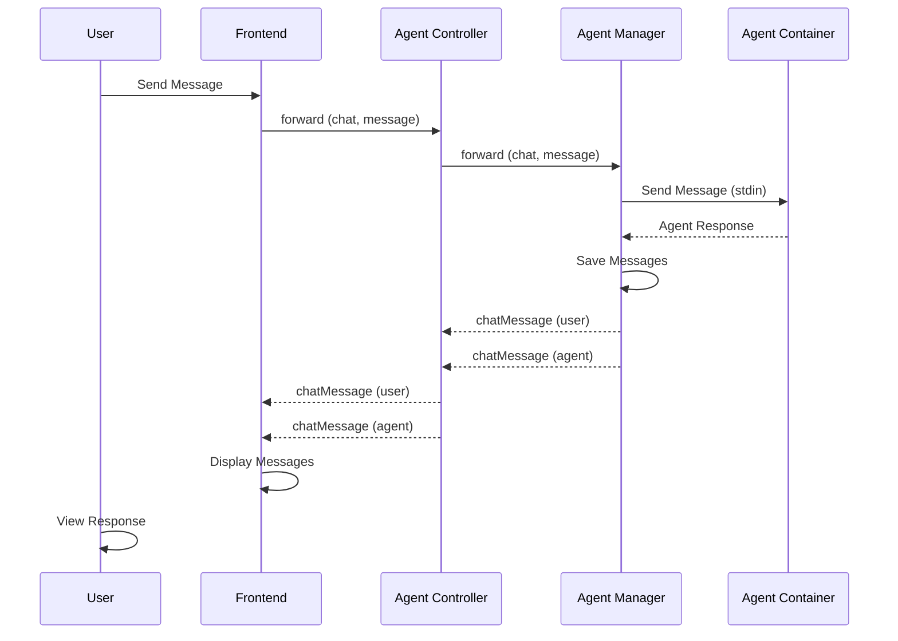

# Chat Interface

AI chat functionality with real-time responses. Send messages to agents and receive instant responses.

## Overview

The chat interface enables real-time bidirectional communication with AI agents. Messages are sent via WebSocket and responses are received instantly. Chat history is automatically maintained and restored on reconnection.

## Features

### Real-time Communication

- Send messages to agents
- Receive instant responses
- View chat history
- Markdown rendering
- Code block syntax highlighting

### Message Types

#### User Messages

Messages sent by the user to the agent:

```typescript
{
  from: 'user',
  text: 'Hello, agent!',
  timestamp: '2024-01-01T00:00:00Z'
}
```

#### Agent Messages

Responses from the agent:

```typescript
{
  from: 'agent',
  response: {
    type: 'text',
    result: 'Hello, user!'
  },
  timestamp: '2024-01-01T00:00:00Z'
}
```

### Chat History

- Chat history is automatically saved
- History is restored on reconnection
- History is cleared when switching agents
- Old events are cleared to prevent duplicates

## Usage

### Sending a Message

1. Type your message in the input field
2. Press Enter or click Send
3. Message is sent to the agent via WebSocket
4. Response is received and displayed

### Viewing History

- Scroll through chat history
- View previous messages
- See message timestamps
- View formatted responses (markdown, code blocks)

## Message Flow



## Related Documentation

- **[WebSocket Communication](./websocket-communication.md)** - Real-time communication details
- **[Agent Management](./agent-management.md)** - Agent authentication
- **[Chat Sequence Diagrams](../../../libs/domains/framework/backend/feature-agent-manager/docs/sequence-ws-chat.mmd)** - Detailed sequence diagrams

---

_For detailed chat functionality, see the [library documentation](../../../libs/domains/framework/backend/feature-agent-manager/README.md#websocket-gateway)._
