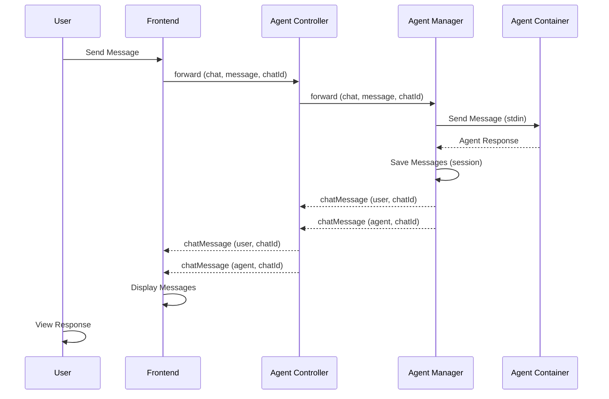

# Chat Interface

AI chat functionality with real-time responses. Send messages to agents and receive instant responses. Each agent environment supports multiple user-visible chat sessions.

## Overview

The chat interface enables real-time bidirectional communication with AI agents. Messages are sent via WebSocket and responses are received instantly. Chat history is maintained per chat session and can be restored on login or when switching sessions.

## Chat sessions

Each agent (environment) has:

- **Primary session** — created with the agent; `kind: primary`. Default target when `chatId` is omitted.
- **User sessions** — additional threads (`kind: user`) that operators create, rename, and delete.

Agent profile responses include:

- `chats` — summaries of user-visible sessions
- `primaryChatId` — id of the primary session

### Hidden ACP sessions

Background and helper flows use reserved ACP `resumeSessionSuffix` values. Those sessions are **not** listed in `chats` and are not shown in the console session switcher:

- `-prompt-enhance`
- `-ticket-body`
- `-ticket-auto-*` (for example `-ticket-auto-pre`, `-ticket-auto-loop`, `-ticket-auto-commit-msg`)

See [Agent Client Protocol](../ai-agents/agent-client-protocol.md) for suffix rules.

### REST API

Console and API clients manage sessions through the agent controller (proxied to the manager):

- Base path: `/clients/{id}/agents/{agentId}/chats`
- List, create, get, update (title), delete
- `GET .../chats/count`
- `GET .../chats/{chatId}/messages` — paginated message history for a session

On the manager, the same operations live under `/api/agents/:agentId/chats`.

### Restoring a session

- **Login** may include optional `chatId`; omitted means the primary session.
- **`restoreChat`** with `{ chatId }` clears the local thread and re-emits recent history for that session (`chatMessage`, related filter/event traffic, then `restoreChatSuccess`).
- Switching sessions in the console uses the same restore path so history stays scoped to the selected `chatId`.

## Features

### Real-time Communication

- Send messages to agents (optionally scoped with `chatId`)
- Receive instant responses
- Switch among multiple sessions per environment
- View chat history per session
- Markdown rendering
- Code block syntax highlighting

### Message Types

#### User Messages

Messages sent by the user to the agent:

```typescript
{
  from: 'user',
  text: 'Hello, agent!',
  timestamp: '2024-01-01T00:00:00Z',
  chatId: 'chat-session-uuid' // present when tied to a persisted session
}
```

#### Agent Messages

Responses from the agent:

```typescript
{
  from: 'agent',
  response: {
    type: 'text',
    result: 'Hello, user!'
  },
  timestamp: '2024-01-01T00:00:00Z',
  chatId: 'chat-session-uuid'
}
```

### Chat History

- History is saved per chat session
- History is restored on login (for the selected or primary `chatId`) and via `restoreChat` when switching sessions
- History is cleared locally when switching agents or sessions (before restore) to avoid duplicates
- Old events are cleared to prevent duplicates

## Usage

### Sending a Message

1. Type your message in the input field
2. Press Enter or click Send
3. Message is sent to the agent via WebSocket (`forward` → `chat`, with the active `chatId` when applicable)
4. Response is received and displayed

### Viewing History

- Scroll through chat history for the active session
- Use the session switcher to open another thread and restore its history
- View previous messages and timestamps
- View formatted responses (markdown, code blocks)

## Message Flow


```mermaid
sequenceDiagram
    participant U as User
    participant F as Frontend
    participant AC as Agent Controller
    participant AM as Agent Manager
    participant A as Agent Container

    U->>F: Send Message
    F->>AC: forward (chat, message, chatId)
    AC->>AM: forward (chat, message, chatId)
    AM->>A: Send Message (stdin)
    A-->>AM: Agent Response
    AM->>AM: Save Messages (session)
    AM-->>AC: chatMessage (user, chatId)
    AM-->>AC: chatMessage (agent, chatId)
    AC-->>F: chatMessage (user, chatId)
    AC-->>F: chatMessage (agent, chatId)
    F->>F: Display Messages
    U->>U: View Response
```

## Related documentation

- **[WebSocket Communication](./websocket-communication.md)** Real-time communication details
- **[Message Filter Rules](./message-filter-rules.md)** Regex policies affecting chat
- **[Agent Management](./agent-management.md)** Agent authentication
- **[Agent Client Protocol](../ai-agents/agent-client-protocol.md)** ACP session suffixes

---

_For detailed chat functionality, see the application and feature docs linked below._
