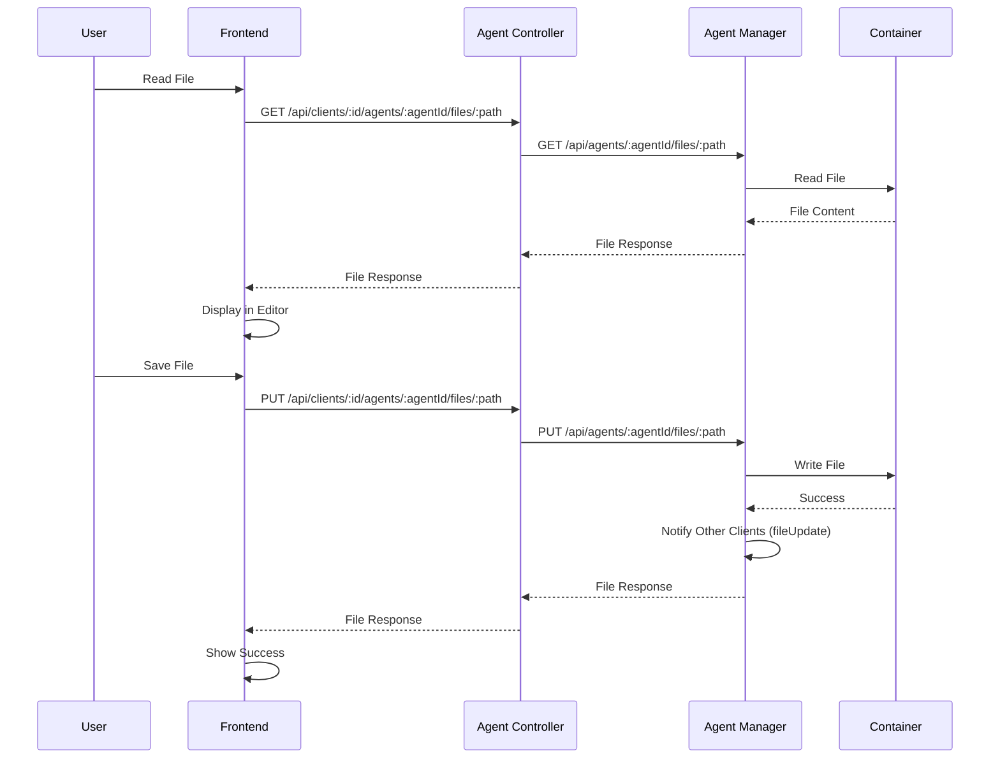

# File Management

File system operations in agent containers. Read, write, create, delete, and move files and directories.

## Overview

File management enables you to interact with the file system in agent containers. All operations are performed directly in the container's workspace, which typically contains a cloned Git repository.

## File Operations

### List Directory

Browse the file system structure:

- Navigate through directories
- View files and subdirectories
- See file metadata (size, type)

### Read File

Open and view file contents:

- Read file content
- Display in Monaco Editor
- Syntax highlighting based on file type
- Code completion and IntelliSense

### Write File

Edit and save file contents:

- Edit files in Monaco Editor
- Save changes to the container
- Real-time file updates
- Automatic syntax validation

### Create File or Directory

Create new files or directories:

- Create files with specified content
- Create empty directories
- Set file permissions

### Delete File or Directory

Remove files or directories:

- Delete individual files
- Delete directories (recursive)
- Confirm before deletion

### Move File or Directory

Move or rename files and directories:

- Move files to different locations
- Rename files and directories
- Update file paths

## File Operation Flow



## Real-time File Updates

When a file is modified, other connected clients are notified via WebSocket:

```typescript
{
  event: 'fileUpdate',
  payload: {
    agentId: 'agent-uuid',
    path: '/path/to/file'
  }
}
```

This enables real-time collaboration and ensures all clients see the latest file state.

## API Endpoints

### File Operations

- `GET /api/clients/:id/agents/:agentId/files` - List directory contents
- `GET /api/clients/:id/agents/:agentId/files/:path` - Read file content
- `POST /api/clients/:id/agents/:agentId/files/:path` - Create file or directory
- `PUT /api/clients/:id/agents/:agentId/files/:path` - Write file content
- `DELETE /api/clients/:id/agents/:agentId/files/:path` - Delete file or directory
- `PATCH /api/clients/:id/agents/:agentId/files/:path` - Move file or directory

For detailed API documentation, see the [Agent Controller Library](../../../libs/domains/framework/backend/feature-agent-controller/README.md#api-endpoints) and [Agent Manager Library](../../../libs/domains/framework/backend/feature-agent-manager/README.md#api-endpoints).

## Related Documentation

- **[Web IDE](./web-ide.md)** - Monaco Editor integration
- **[Version Control](./version-control.md)** - Git operations
- **[Agent Management](./agent-management.md)** - Agent containers
- **[File Operation Sequence Diagrams](../../../libs/domains/framework/backend/feature-agent-manager/docs/sequence-http-files.mmd)** - Detailed sequence diagrams

---

_For detailed file operation information, see the [library documentation](../../../libs/domains/framework/backend/feature-agent-manager/README.md)._
