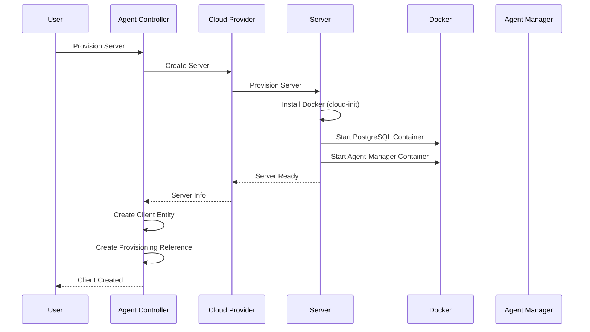

# Server Provisioning

Automated cloud server provisioning with Docker and agent-manager deployment. Supports Hetzner Cloud and DigitalOcean.

## Overview

Server provisioning enables you to automatically:

1. Create a cloud server instance
2. Install Docker CE
3. Deploy PostgreSQL and agent-manager containers
4. Configure authentication, Git repositories, and agent settings
5. Create a client entity in the controller

## Supported Providers

### Hetzner Cloud

- **Provider Type**: `hetzner`
- **Requires**: `HETZNER_API_TOKEN` environment variable
- **Server Types**: Various sizes (e.g., `cx11`, `cx21`, `cx31`)
- **Locations**: Multiple datacenters (e.g., `fsn1`, `nbg1`, `hel1`)

### DigitalOcean

- **Provider Type**: `digital-ocean`
- **Requires**: `DIGITALOCEAN_API_TOKEN` environment variable
- **Server Types**: Various sizes (e.g., `s-1vcpu-1gb`, `s-2vcpu-2gb`)
- **Locations**: Multiple regions (e.g., `fra1`, `nyc3`, `sgp1`)

## Provisioning Process

## Provisioning Request

The provisioning endpoint accepts a `ProvisionServerDto` with the following fields:

### Required Fields

- **`providerType`** - Provider identifier (`"hetzner"` or `"digital-ocean"`)
- **`serverType`** - Server type identifier (e.g., `"cx11"` for Hetzner, `"s-1vcpu-1gb"` for DigitalOcean)
- **`name`** - Server name (auto-generated if not provided)
- **`authenticationType`** - Authentication type (`"api_key"` or `"keycloak"`)

### Optional Fields

- **`description`** - Server description
- **`location`** - Datacenter location (e.g., `"fsn1"`, `"nbg1"` for Hetzner; `"fra1"`, `"nyc3"` for DigitalOcean)
- **`apiKey`** - API key for API_KEY authentication (auto-generated if not provided)
- **`keycloakClientId`** - Keycloak client ID (required for KEYCLOAK authentication)
- **`keycloakClientSecret`** - Keycloak client secret (required for KEYCLOAK authentication)
- **`keycloakRealm`** - Keycloak realm (optional, defaults to environment variable)
- **`keycloakAuthServerUrl`** - Keycloak auth server URL (optional, defaults to environment variable)
- **`agentWsPort`** - Agent WebSocket port (defaults to 8080)
- **`gitRepositoryUrl`** - Git repository URL for agent workspace
- **`gitUsername`** - Git username for repository access
- **`gitToken`** - Git token/personal access token for repository access
- **`gitPassword`** - Git password for repository access (alternative to token)
- **`cursorApiKey`** - Cursor API key for agent configuration
- **`agentDefaultImage`** - Default Docker image for cursor agents (defaults to `ghcr.io/forepath/agenstra-manager-worker:latest`)

## Provisioning Steps

1. **Server Creation**: The provider creates a cloud server instance
2. **Docker Installation**: The server automatically installs Docker CE via cloud-init user data script
3. **Database Setup**: PostgreSQL container is started with health checks
4. **Agent-Manager Deployment**: Agent-manager container is deployed with:
   - Authentication configuration (API key or Keycloak)
   - Database connection to PostgreSQL
   - Git repository configuration (if provided)
   - Cursor agent configuration (if provided)
5. **Client Creation**: A client entity is created in the database with the server's endpoint
6. **Reference Storage**: A provisioning reference links the client to the cloud server

## Server Configuration

The provisioned server exposes:

- **HTTP API**: Port 3000 (agent-manager REST API)
- **WebSocket**: Port 8080 (agent-manager WebSocket gateway)

## Environment Variables Interpolation

All configuration values are properly interpolated into the docker-compose.yml file on the provisioned server:

- **Authentication**: `STATIC_API_KEY` or Keycloak variables
- **Git Configuration**: `GIT_REPOSITORY_URL`, `GIT_USERNAME`, `GIT_TOKEN`, `GIT_PASSWORD`
- **Cursor Agent**: `CURSOR_API_KEY`, `AGENT_DEFAULT_IMAGE`

Values are securely passed from the frontend through the backend to the user data script, which generates the docker-compose.yml with all environment variables properly set.

## Managing Provisioned Servers

### View Server Information

- Get server information (IP address, status, etc.) for a provisioned client
- View server configuration and deployment status

### Delete Provisioned Server

1. Select a provisioned client
2. Click "Delete Server"
3. Confirm deletion

The system will:

- Delete the cloud server instance
- Delete the client entity
- Delete the provisioning reference

**Warning**: This will permanently delete the server and all associated data.

## API Endpoints

### Server Provisioning

- `GET /api/clients/provisioning/providers` - List available provisioning providers
- `GET /api/clients/provisioning/providers/:providerType/server-types` - Get available server types for a provider
- `POST /api/clients/provisioning/provision` - Provision a new server and create a client
- `GET /api/clients/:id/provisioning/info` - Get server information for a provisioned client
- `DELETE /api/clients/:id/provisioning` - Delete a provisioned server and its associated client

For detailed API documentation, see the [Agent Controller Library](../../../libs/domains/framework/backend/feature-agent-controller/README.md#api-endpoints).

## Related Documentation

- **[Client Management](./client-management.md)** - Managing clients
- **[Backend Agent Controller Application](../applications/backend-agent-controller.md)** - Application details
- **[Provisioning Architecture Diagram](../../../libs/domains/framework/backend/feature-agent-controller/docs/provisioning-architecture.mmd)** - Visual architecture diagram
- **[Provisioning Sequence Diagram](../../../libs/domains/framework/backend/feature-agent-controller/docs/server-provisioning-sequence.mmd)** - Detailed sequence diagram

---

_For detailed provisioning information, see the [library documentation](../../../libs/domains/framework/backend/feature-agent-controller/README.md#server-provisioning)._
