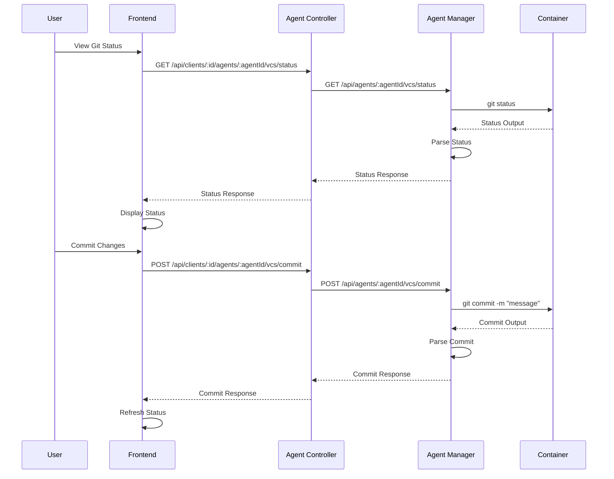

# Version Control

Full Git operations directly from the web interface. View status, manage branches, commit, push, pull, and resolve conflicts.

## Overview

Version control enables you to perform Git operations directly in agent containers. All operations are performed in the container's workspace, which contains a cloned Git repository.

## Git Operations

### View Status

View the current Git status:

- Current branch
- Modified files
- Staged files
- Untracked files
- Unpushed commits

### Manage Branches

- List all branches (local and remote)
- Create new branches
- Switch between branches
- Delete branches
- View branch information

### Stage and Unstage Files

- Stage individual files
- Stage all files
- Unstage files
- View staged changes

### Commit Changes

- Commit staged changes
- Write commit messages
- View commit history
- See commit details

### Push and Pull

- Push changes to remote
- Pull changes from remote
- Fetch changes from remote
- Force push (with lease)

### Advanced Operations

- Rebase current branch onto another branch
- View file diffs
- Resolve merge conflicts
- Switch branches

## Git Operation Flow

## API Endpoints

### Version Control Operations

- `GET /api/clients/:id/agents/:agentId/vcs/status` - Get git status
- `GET /api/clients/:id/agents/:agentId/vcs/branches` - List all branches
- `GET /api/clients/:id/agents/:agentId/vcs/diff?path={filePath}` - Get file diff
- `POST /api/clients/:id/agents/:agentId/vcs/stage` - Stage files
- `POST /api/clients/:id/agents/:agentId/vcs/unstage` - Unstage files
- `POST /api/clients/:id/agents/:agentId/vcs/commit` - Commit staged changes
- `POST /api/clients/:id/agents/:agentId/vcs/push` - Push changes to remote
- `POST /api/clients/:id/agents/:agentId/vcs/pull` - Pull changes from remote
- `POST /api/clients/:id/agents/:agentId/vcs/fetch` - Fetch changes from remote
- `POST /api/clients/:id/agents/:agentId/vcs/rebase` - Rebase current branch
- `POST /api/clients/:id/agents/:agentId/vcs/branches/:branch/switch` - Switch to a branch
- `POST /api/clients/:id/agents/:agentId/vcs/branches` - Create a new branch
- `DELETE /api/clients/:id/agents/:agentId/vcs/branches/:branch` - Delete a branch
- `POST /api/clients/:id/agents/:agentId/vcs/conflicts/resolve` - Resolve merge conflicts

For detailed API documentation, see the [Agent Controller Library](../../../libs/domains/framework/backend/feature-agent-controller/README.md#api-endpoints) and [Agent Manager Library](../../../libs/domains/framework/backend/feature-agent-manager/README.md#api-endpoints).

## Related Documentation

- **[File Management](./file-management.md)** - File operations
- **[Agent Management](./agent-management.md)** - Agent containers
- **[VCS Sequence Diagrams](../../../libs/domains/framework/backend/feature-agent-manager/docs/sequence-http-vcs.mmd)** - Detailed sequence diagrams

---

_For detailed VCS operation information, see the [library documentation](../../../libs/domains/framework/backend/feature-agent-manager/README.md#api-endpoints)._
