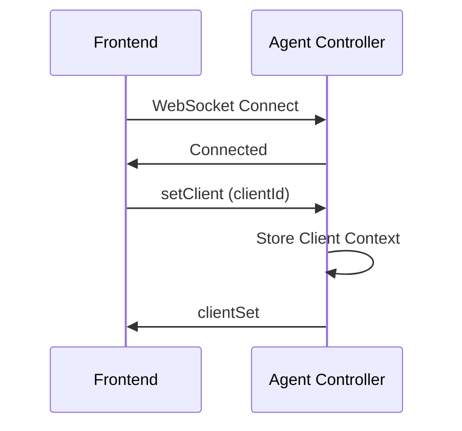
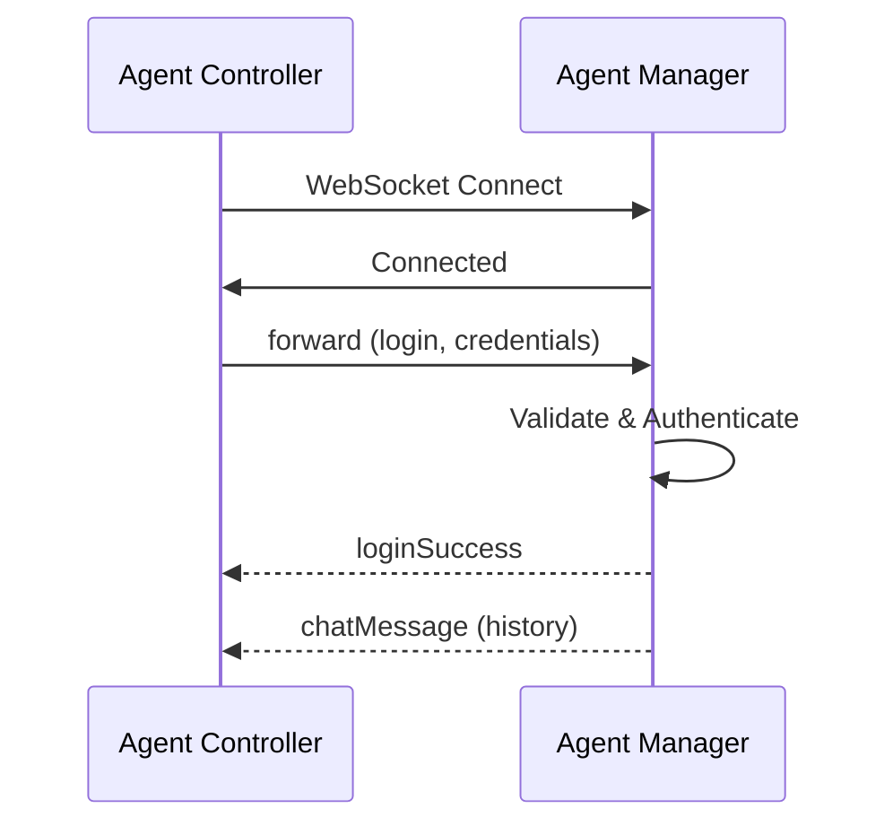
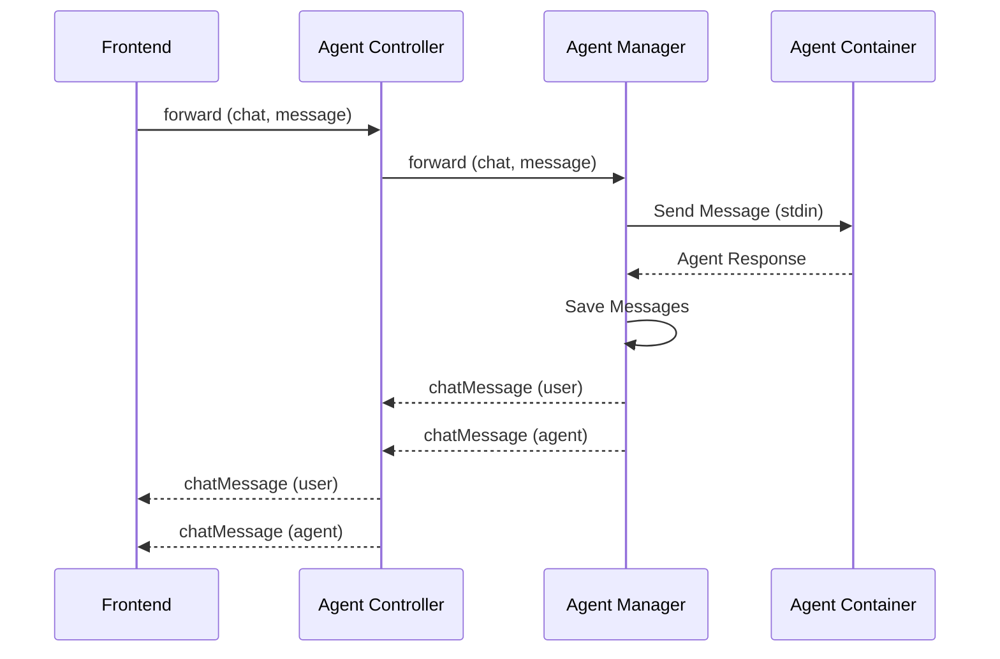

# WebSocket Communication

Real-time bidirectional communication between frontend, controller, and manager using Socket.IO WebSocket connections.

## Overview

Agenstra uses WebSocket (Socket.IO) for real-time bidirectional communication. The architecture supports:

- **Frontend ↔ Controller**: Event forwarding and client context management
- **Controller ↔ Manager**: Event forwarding to remote agent-managers
- **Manager ↔ Agent Containers**: Real-time chat and container communication

## Connection Flow

### Frontend to Controller



### Controller to Manager



## Events

### Frontend → Controller

#### setClient

Set the client context for subsequent operations:

```typescript
socket.emit('setClient', {
  clientId: 'client-uuid',
});
```

#### forward

Forward an event to the remote agent-manager:

```typescript
socket.emit('forward', {
  event: 'chat',
  payload: { message: 'Hello, agent!' },
  agentId: 'agent-uuid', // Optional, for auto-login
});
```

### Controller → Frontend

#### clientSet

Confirmation that client context was set:

```typescript
{
  clientId: 'client-uuid',
  message: 'Client context set'
}
```

#### forwardedEvent

Events forwarded from the remote agent-manager:

```typescript
{
  event: 'chatMessage',
  payload: {
    from: 'agent',
    text: 'Hello, user!',
    timestamp: '2024-01-01T00:00:00Z'
  }
}
```

### Manager → Controller

#### loginSuccess

Authentication successful:

```typescript
{
  message: 'Welcome, Agent Name!';
}
```

#### chatMessage

Chat messages (user or agent):

```typescript
// User message
{
  from: 'user',
  text: 'Hello, agent!',
  timestamp: '2024-01-01T00:00:00Z'
}

// Agent message
{
  from: 'agent',
  response: {
    type: 'text',
    result: 'Hello, user!'
  },
  timestamp: '2024-01-01T00:00:00Z'
}
```

## Reconnection Handling

### Frontend Reconnection

When the frontend reconnects to the controller:

1. WebSocket automatically reconnects
2. Frontend sends `setClient` event to restore context
3. Frontend sends `forward` event with `login` to restore agent login
4. Controller forwards login to manager
5. Manager restores chat history
6. Frontend clears old events to prevent duplicates

### Controller-to-Manager Reconnection

When the controller reconnects to a manager:

1. WebSocket automatically reconnects
2. Controller automatically restores agent logins for all previously logged-in agents
3. Manager restores chat history for each agent
4. Events are forwarded to the frontend

## Chat History Restoration

Chat history is automatically restored on reconnection:

1. When an agent logs in, the manager loads and emits all chat history
2. History is sent as `chatMessage` events
3. Frontend receives and displays the history
4. Old events are cleared to prevent duplicates

## Event Forwarding

The controller forwards events bidirectionally:

- **Frontend → Manager**: User events (chat, file operations, etc.)
- **Manager → Frontend**: Agent responses and events

### Example: Chat Message Flow



## Error Handling

### Connection Errors

- Automatic reconnection with exponential backoff
- State restoration on reconnection
- Error events sent to frontend

### Authentication Errors

- `loginError` event on authentication failure
- Generic error messages to prevent information disclosure
- Automatic retry on reconnection

## Related Documentation

- **[Chat Interface](./chat-interface.md)** - Chat functionality details
- **[Agent Management](./agent-management.md)** - Agent authentication
- **[Backend Agent Controller Application](../applications/backend-agent-controller.md)** - Controller WebSocket details
- **[Backend Agent Manager Application](../applications/backend-agent-manager.md)** - Manager WebSocket details
- **[AsyncAPI Specifications](../../../libs/domains/framework/backend/feature-agent-controller/spec/asyncapi.yaml)** - Complete WebSocket specification

---

_For detailed WebSocket event specifications, see the [library documentation](../../../libs/domains/framework/backend/feature-agent-controller/README.md#websocket-gateway)._
