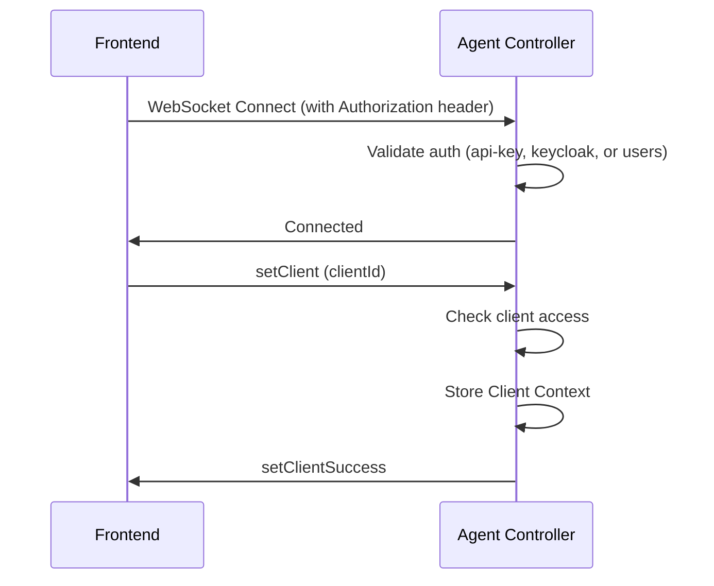
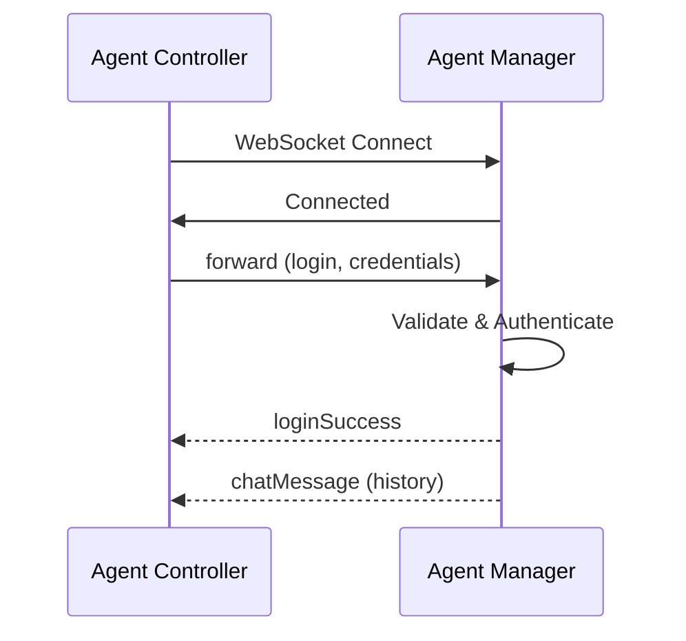
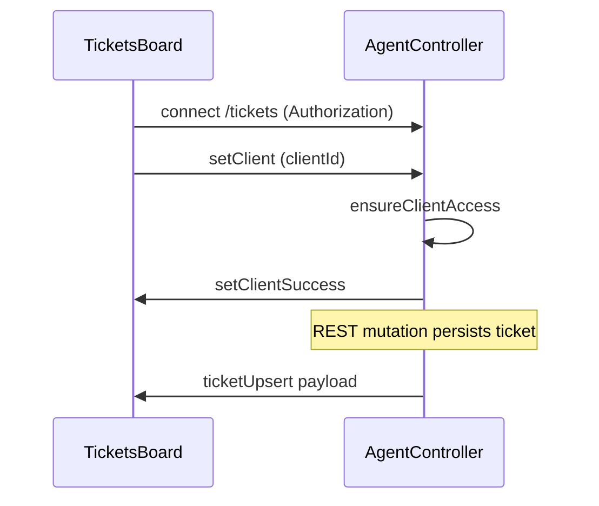
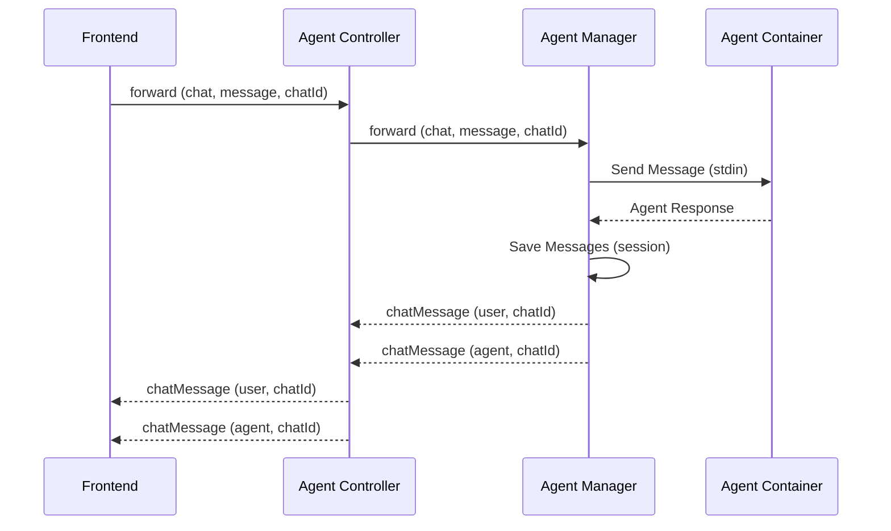

# WebSocket Communication

Real-time bidirectional communication between frontend, controller, and manager using Socket.IO WebSocket connections.

## Overview

Agenstra uses WebSocket (Socket.IO) for real-time bidirectional communication. The architecture supports:

- **Frontend ↔ Controller (`clients` namespace)**: Workspace selection (`setClient`), `forward` to remote agent-managers, and controller-originated ticket hints for chat
- **Frontend ↔ Controller (`tickets` namespace)**: Ticket board and automation realtime for subscribers
- **Frontend ↔ Controller (`status` namespace)**: Per-user workspace/environment notification state (git dirty, unread chat) without `setClient`
- **Controller ↔ Manager**: Event forwarding to remote agent-managers
- **Manager ↔ Agent Containers**: Real-time chat and container communication

On the controller, **`clients`**, **`tickets`**, **`pages`** (knowledge), and **`status`** share the same TCP port (`WEBSOCKET_PORT`); namespaces are selected in the Socket.IO client path.

## Authentication

WebSocket connections to the controller require authentication. Pass the `Authorization` header in the handshake (same as HTTP):

- **API key**: `Bearer <static-api-key>` or `ApiKey <static-api-key>`
- **Keycloak**: `Bearer <keycloak-jwt-token>`
- **Users**: `Bearer <jwt-token>`

Unauthenticated connections are rejected with `connect_error` "Unauthorized". The `setClient` operation enforces per-client authorization: only users with access to the requested client (global admin, client creator, or client_users entry) can set that client context. Unauthorized attempts emit an `error` event with message "You do not have access to this client".

### Agent console status (`status` namespace)

The agent console opens a dedicated Socket.IO connection to **`status`** (derived from `controller.websocketUrl` by replacing `/clients` with `/status`, or via `controller.statusWebsocketUrl`). Handshake auth matches other controller namespaces.

- **No `setClient`**: the stream is scoped to the authenticated user only.
- **On connect**: server emits **`statusSnapshot`** with all accessible workspaces/environments (git dirty + unread flags).
- **While connected**: server emits **`statusPatch`** for deltas; background polling (`STATUS_POLL_INTERVAL_MS`, default 30s) refreshes git state and catches unread when no `clients` socket is active. Successful VCS mutations proxied through the controller (stage, commit, fetch, pull, push including force, branch operations, conflict resolve, prepare-clean workspace) also emit **`statusPatch`** immediately to every user with access to that workspace.
- **Agent workspace changes**: agent-manager broadcasts **`gitStateChanged`** on the agents namespace after file writes, file-update notifications, workspace-affecting agent tool results, and local VCS/file mutations. The controller **`clients`** gateway listens for **`gitStateChanged`** and **`fileUpdateNotification`**, then pushes **`statusPatch`** on the **`status`** namespace to users with workspace access (same security model as VCS proxy hooks).
- **Client → server**: `markEnvironmentRead` `{ clientId, agentId }`, `setActiveEnvironment` `{ clientId, agentId | null }`.
- **Unread** includes agent chat replies and live ticket automation chat card updates; read cursors persist in `user_environment_read_state` on the controller database.

See `libs/domains/agenstra/backend/feature-agent-controller/spec/asyncapi.yaml` and `libs/domains/agenstra/frontend/data-access-agent-console/docs/notifications-state.mmd`.

## Connection Flow

### Frontend to Controller


```mermaid
sequenceDiagram
    participant F as Frontend
    participant AC as Agent Controller

    F->>AC: WebSocket Connect (with Authorization header)
    AC->>AC: Validate auth (api-key, keycloak, or users)
    AC->>F: Connected
    F->>AC: setClient (clientId)
    AC->>AC: Check client access
    AC->>AC: Store Client Context
    AC->>F: setClientSuccess
```

### Controller to Manager


```mermaid
sequenceDiagram
    participant AC as Agent Controller
    participant AM as Agent Manager

    AC->>AM: WebSocket Connect
    AM->>AC: Connected
    AC->>AM: forward (login, credentials)
    AM->>AM: Validate & Authenticate
    AM-->>AC: loginSuccess
    AM-->>AC: chatMessage (history)
```

## Events

### Frontend → Controller

#### setClient

Set the client context for subsequent operations:

```typescript
socket.emit('setClient', {
  clientId: 'client-uuid',
});
```

#### forward

Forward an event to the remote agent-manager:

```typescript
socket.emit('forward', {
  event: 'chat',
  payload: { message: 'Hello, agent!', chatId: 'chat-session-uuid' }, // chatId optional; primary when omitted
  agentId: 'agent-uuid', // Optional, for auto-login
});
```

Common forwarded agent-manager events for chat:

- `login` — credentials plus optional `chatId` (defaults to the agent’s primary session)
- `chat` — message payload; optional `chatId` scopes persistence and emits to that user-visible session
- `restoreChat` — `{ chatId }` to re-emit history for a specific session after the client clears its local thread

### Controller → Frontend (`clients` namespace)

#### setClientSuccess

Confirmation that client context was set (or was already selected):

```typescript
{
  clientId: 'client-uuid',
  message: 'Client context set'
}
```

#### forwardAck

Acknowledgement that a `forward` command was accepted for dispatch to the manager.

#### Proxied manager events

The controller re-emits manager events **using their original event names** to the initiating browser socket only (for example `chatMessage`, `containerStats`, `terminalOutput`). Shapes match the agent-manager AsyncAPI.

#### Controller-originated ticket events (still on `clients`)

To refresh ticket metadata in chat without subscribing to `tickets`, the controller may emit `ticketChatTicketUpsert` and automation timeline payloads such as `ticketAutomationRunChatUpsert` to room `client:{clientId}`. See the agent-controller AsyncAPI for fields.

### Manager → Controller

#### loginSuccess

Authentication successful:

```typescript
{
  message: 'Welcome, Agent Name!';
}
```

#### chatMessage

Chat messages (user or agent). When the turn belongs to a persisted user-visible session, `data` includes `chatId`:

```typescript
// User message
{
  from: 'user',
  text: 'Hello, agent!',
  timestamp: '2024-01-01T00:00:00Z',
  chatId: 'chat-session-uuid'
}

// Agent message
{
  from: 'agent',
  response: {
    type: 'text',
    result: 'Hello, user!'
  },
  timestamp: '2024-01-01T00:00:00Z',
  chatId: 'chat-session-uuid'
}
```

#### restoreChat / restoreChatSuccess

Client requests history for a session; server acknowledges after replaying events:

```typescript
// Client → Manager (via forward)
{ chatId: 'chat-session-uuid' }

// Manager → Client
{
  success: true,
  data: { chatId: 'chat-session-uuid', message: '...' },
  timestamp: '2024-01-01T00:00:00Z'
}
```

## Tickets board realtime (`tickets` namespace)

Use a second Socket.IO connection to the same controller WebSocket origin with namespace **`tickets`** (override via `TICKETS_WEBSOCKET_NAMESPACE` on the server).

### Flow


```mermaid
sequenceDiagram
    participant UI as TicketsBoard
    participant AC as AgentController

    UI->>AC: connect /tickets (Authorization)
    UI->>AC: setClient (clientId)
    AC->>AC: ensureClientAccess
    AC->>UI: setClientSuccess
    Note over AC: REST mutation persists ticket
    AC->>UI: ticketUpsert payload
```

### Client → Server

- `setClient` with `{ clientId }`, joins Socket.IO room `client:{clientId}` when authorized

### Server → Client

Typical events include `ticketUpsert`, `ticketRemoved`, `ticketCommentCreated`, `ticketActivityCreated`, `ticketAutomationUpsert`, `ticketAutomationRunUpsert`, `ticketAutomationRunStepAppended`, and `knowledgeRelationChanged` (same relation payload as the pages namespace). Errors use the `error` event on this namespace.

See **[Tickets and Workspaces](./tickets-and-workspaces.md)** for product context and **[Backend Agent Controller Application](../applications/backend-agent-controller.md)** for configuration.

## Knowledge board realtime (`pages` namespace)

Use namespace **`pages`** on the same controller WebSocket origin. After `setClient`, room broadcasts include `knowledgeTreeChanged`, `knowledgeRelationChanged`, and `knowledgePageActivityCreated`. Errors use `error`.

REST source of truth: OpenAPI `/knowledge/*` on the agent-controller.

## Reconnection Handling

### Frontend Reconnection

When the frontend reconnects to the controller:

1. WebSocket automatically reconnects (repeat for `tickets` if used)
2. Frontend sends `setClient` event to restore context on each namespace
3. Frontend sends `forward` event with `login` (optional `chatId`) to restore agent login (`clients` only)
4. Controller forwards login to manager
5. Manager restores chat history for the selected or primary session
6. Frontend clears old events to prevent duplicates; switching sessions uses `restoreChat` with the target `chatId`

### Controller-to-Manager Reconnection

When the controller reconnects to a manager:

1. WebSocket automatically reconnects
2. Controller automatically restores agent logins for all previously logged-in agents
3. Manager restores chat history for each agent
4. Events are forwarded to the frontend

## Chat History Restoration

Chat history is restored per session:

1. On `login`, the manager loads recent history for the requested `chatId` (or the primary session when omitted)
2. History is sent as `chatMessage` events (with `chatId` when applicable)
3. To switch sessions without re-login, the client emits `restoreChat` with `{ chatId }`; the manager re-emits history and then `restoreChatSuccess`
4. Frontend clears the previous local thread before restore to prevent duplicates

## Event Forwarding

The controller forwards events bidirectionally:

- **Frontend → Manager**: User events (chat, file operations, etc.)
- **Manager → Frontend**: Agent responses and events

### Example: Chat Message Flow


```mermaid
sequenceDiagram
    participant F as Frontend
    participant AC as Agent Controller
    participant AM as Agent Manager
    participant A as Agent Container

    F->>AC: forward (chat, message, chatId)
    AC->>AM: forward (chat, message, chatId)
    AM->>A: Send Message (stdin)
    A-->>AM: Agent Response
    AM->>AM: Save Messages (session)
    AM-->>AC: chatMessage (user, chatId)
    AM-->>AC: chatMessage (agent, chatId)
    AC-->>F: chatMessage (user, chatId)
    AC-->>F: chatMessage (agent, chatId)
```

## Error Handling

### Connection Errors

- Automatic reconnection with exponential backoff
- State restoration on reconnection
- Error events sent to frontend

### Authentication Errors

- `connect_error` "Unauthorized" when WebSocket auth fails
- `error` "You do not have access to this client" when setClient is forbidden
- `loginError` event on agent authentication failure
- Generic error messages to prevent information disclosure
- Automatic retry on reconnection

## Related documentation

- **[Chat Interface](./chat-interface.md)** Chat functionality details
- **[Tickets and Workspaces](./tickets-and-workspaces.md)** Ticket board and automation
- **[Agent Management](./agent-management.md)** Agent authentication
- **[Backend Agent Controller Application](../applications/backend-agent-controller.md)** Controller WebSocket details
- **[Backend Agent Manager Application](../applications/backend-agent-manager.md)** Manager WebSocket details

---

_For detailed WebSocket event specifications, see the [API Reference](../api-reference/README.md) and the published [Agent Controller AsyncAPI](/spec/agent-controller/asyncapi.yaml) and [Agent Manager AsyncAPI](/spec/agent-manager/asyncapi.yaml)._
