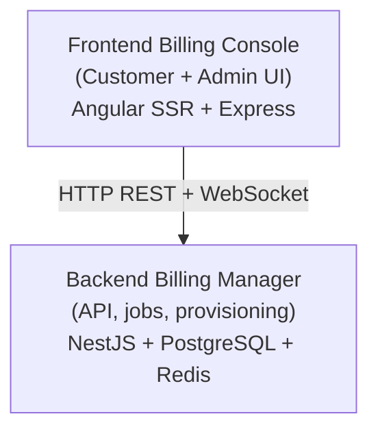

# Decabill Documentation

Welcome to the documentation for **Decabill**, the ForePath billing product for subscriptions, invoicing, payment processing, and customer billing administration.

## What is Decabill?

Decabill lets operators and customers manage billing in one place:

- **Subscriptions and service plans** with configurable providers and pricing
- **Invoicing and payments** including Stripe checkout flows
- **Customer self-service** for profiles, invoices, and subscription lifecycle
- **Administration** for manual invoices, customer billing profiles, and operational dashboards
- **Multi-tenant deployments** with tenant-scoped data and configurable frontends
- **Server provisioning** for bundled product stacks via cloud-init when service plans include infrastructure
- **Projects and project boards** for customer-assigned work, time tracking, and billable-hours invoicing

## Documentation Structure

### [Getting Started](./getting-started.md)

Your entry point to Decabill, including:

- Prerequisites and installation
- Basic setup and configuration
- First login to the billing console
- Quick verification of the stack

### [Architecture](./architecture/README.md)

Understanding the system architecture:

- [System Overview](./architecture/system-overview.md) High-level architecture and component relationships
- [Components](./architecture/components.md) Detailed breakdown of all system components
- [Data Flow](./architecture/data-flow.md) Communication patterns and data flow

### [Applications](./applications/README.md)

Detailed documentation for each application:

- [Frontend Billing Console](./applications/frontend-billing-console.md) Customer and admin Angular SSR console
- [Backend Billing Manager](./applications/backend-billing-manager.md) NestJS API, jobs, provisioning, and WebSockets

### [Features](./features/README.md)

Product capabilities including:

- Subscriptions, invoices, payments, and administration
- Multi-tenancy, VAT, promotions, and auto-billing
- Projects, project boards, and real-time dashboard status
- Server provisioning, cloud-init, and dynamic provider plugins

### [Deployment](./deployment/README.md)

Deployment guides and configuration:

- [Local Development](./deployment/local-development.md) Setting up for local development
- [Docker Deployment](./deployment/docker-deployment.md) Containerized deployment guide
- [System Requirements](./deployment/system-requirements.md) CPU, memory, and disk by role
- [Environment Configuration](./deployment/environment-configuration.md) Complete environment variables reference
- [Production Checklist](./deployment/production-checklist.md) Production deployment guide
- [Operator Runbook](./deployment/operator-runbook.md) Install, day-2 ops, and disclosure checklists
- [Background Jobs](./deployment/background-jobs.md) BullMQ queue roles, Redis, and job registry

### [Security](./security/README.md)

Public security and compliance-oriented documentation:

- [Compliance and standards](./security/compliance-and-standards.md) EU CRA and BSI IT-Grundschutz documentation themes (informative)
- [Accepted risks](./security/accepted-risks.md) Accepted-risk register with mitigations and review dates
- [Container image security](./security/container-images.md) Non-root users, bind mounts, restricted sudo
- [Operational hardening](./security/operational-hardening.md) Implemented controls and operator notes
- [Vulnerability reporting and artifacts](./security/vulnerability-reporting-and-artifacts.md) Disclosure process, SBOM paths, and artifacts
- [CI security scanning](./security/ci-security-scanning.md) Trivy gates and ignore policy

### [API Reference](./api-reference/README.md)

Billing Manager HTTP OpenAPI and WebSocket AsyncAPI specifications.

### [AI Agents Context](./ai-agents/README.md)

AI coding assistant guides for Decabill:

- Workspace `.agenstra` context (rules, commands, skills, agents, MCP, agentctx, knowledge graph)
- Decabill project map and graph recipes

### [Troubleshooting](./troubleshooting/README.md)

Problem-solving guides:

- [Common Issues](./troubleshooting/common-issues.md) Common problems and solutions
- [Debugging Guide](./troubleshooting/debugging-guide.md) Debugging strategies and tools

## Quick Start

New to Decabill? Follow this path:

1. **[Getting Started](./getting-started.md)** for local setup
2. **[System Overview](./architecture/system-overview.md)** for architecture
3. **[Multi-tenancy](./features/multi-tenancy.md)** if you run more than one tenant
4. **[Environment Configuration](./deployment/environment-configuration.md)** before production

## System Architecture

Decabill follows a two-tier architecture:

## External resources

- [NestJS Documentation](https://docs.nestjs.com/) Backend framework documentation
- [Angular Documentation](https://angular.dev/) Frontend framework documentation
- [Stripe Documentation](https://stripe.com/docs) Payment processor documentation

## Licensing

Decabill uses a split license model aligned with the [pricing tiers](https://decabill.com/pricing):

| Component                                         | Path                                                                                                                                                             | License                                                          |
| ------------------------------------------------- | ---------------------------------------------------------------------------------------------------------------------------------------------------------------- | ---------------------------------------------------------------- |
| Billing manager (backend API, jobs, provisioning) | `apps/decabill/backend-billing-manager`, `libs/domains/decabill/backend/feature-billing-manager`                                                                 | [AGPL-3.0](https://www.gnu.org/licenses/agpl-3.0.html)           |
| Billing console (Angular UI)                      | `apps/decabill/frontend-billing-console`, `libs/domains/decabill/frontend/feature-billing-console`, `libs/domains/decabill/frontend/data-access-billing-console` | [BUSL-1.1](https://mariadb.com/bsl11/) with Additional Use Grant |
| Landing page (marketing site)                     | `apps/decabill/frontend-landingpage`, `libs/domains/decabill/frontend/feature-landingpage`                                                                       | Source-available (LICENSE in the landing page app directory)     |

The AGPL backend is available under the **Open Source** tier. The BUSL billing console is included from the **Startup** tier onward when your organization qualifies for the Additional Use Grant. The landing page is source-available; you may view the source code but no other rights are granted. See the LICENSE file in each component directory for the full text.

---

_For repository-wide security contact and supported versions, see the root `SECURITY.md` file in the GitHub repository._
