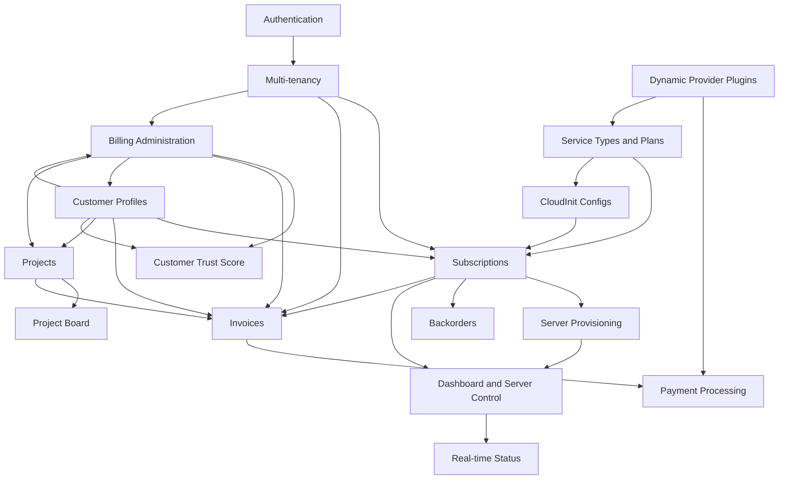

# Features Documentation

This section provides comprehensive documentation for all features in the Decabill billing product.

## Overview

Decabill provides a complete set of capabilities for subscription billing, invoicing, payments, and optional infrastructure provisioning:

- **Authentication** Keycloak OAuth2/OIDC, built-in users with JWT, or static API key
- **Multi-tenancy** Tenant-scoped data with `X-Tenant` header and configurable tenant frontends
- **Numbering** Shared or tenant-scoped invoice, subscription, and DATEV debtor number pools
- **Subscriptions** Order, cancel, and resume service plans with optional cloud provisioning
- **Usage meters** Tenant meter catalog attachable to plans and addons with attachment-scoped usage billing
- **Advance billing and yearly interval** Prepaid period charges and `year` billing interval
- **Invoices** ZUGFeRD PDFs, open positions, billing-day accumulation, and Stripe checkout
- **Service Types and Plans** Admin-managed catalog with provider schemas and pricing
- **Billing Administration** Manual invoices, customer profiles, KPIs, and bill-now
- **Customer Profiles** Self-service and admin billing metadata required for ordering
- **VAT and tax treatment** EU place-of-supply modes, VIES VAT ID validation, OSS threshold, reverse charge
- **Customer Trust Score** Admin-only traffic-light trust ranking on billing profiles
- **Dashboard and Server Control** Overview of subscriptions with start, stop, and restart actions
- **Real-time Status** WebSocket dashboard stream for provisioned server status
- **Backorders** Queue and retry when provider capacity is unavailable
- **Public Withdrawal** Statutory withdrawal without login at `/withdrawal`
- **Payment Processing** Stripe checkout and webhook-driven payment state
- **Dynamic Provider Plugins** Extend payment processors and billing UI metadata at runtime
- **Server Provisioning** Cloud-init deployment of bundled product stacks for eligible plans
- **CloudInit Configs** Admin-managed Docker templates for the custom service kind
- **Projects** Customer-assigned work tracking with admin CRUD and billable time
- **Project Board** Live ticket board with swimlanes and WebSocket updates
- **OpenTelemetry** Optional Prometheus metrics and OTLP export (disabled by default)

## Features

### [Authentication](./authentication.md)

Multiple authentication methods with configurable user registration. Supports API key, Keycloak OAuth2/OIDC, and built-in users with JWT.

**Key Capabilities**:

- Static API key for automation and single-operator deployments
- Keycloak OAuth2/OIDC for enterprise SSO
- Built-in user registration with email confirmation
- Password reset with 6-character alphanumeric codes
- Admin user management and optional signup disable

### [Multi-tenancy](./multi-tenancy.md)

Isolate billing data per tenant while sharing one billing manager deployment. Same email can register separately in each tenant.

**Key Capabilities**:

- `X-Tenant` header on HTTP and WebSocket requests
- `TENANTS` environment allowlist
- `TENANTS_ALLOW_DEFAULT=false` to exclude the implicit `default` tenant
- Per-tenant Stripe return URLs via `TENANT_FRONTEND_URLS`
- Optional `STATIC_API_KEY_TENANT_ID` to bind API key auth to one tenant

### [Numbering](./numbering.md)

Shared (default) or tenant-scoped pools for invoice, subscription, customer, and DATEV debtor numbers via `TENANTS_SHARED_NUMBERS`. Hostnames stay globally unique.

**Key Capabilities**:

- Default shared pools for simpler authority-facing uniqueness
- `TENANTS_SHARED_NUMBERS=false` for per-tenant number isolation
- Webhook `datev.debtor_range_exhausted` when DATEV debtor ranges run out

### [Subscriptions](./subscriptions.md)

Order service plans, manage lifecycle (cancel, resume), and provision cloud instances when the plan includes infrastructure. Optional promotion codes can be validated at checkout and redeemed on the new subscription.

**Key Capabilities**:

- Subscription creation with availability checks and provider config validation
- Optional `promotionCode` at order time (validated before submit)
- Cancel and resume with effective dates (`cancel_scheduled` vs final cancel)
- Mid-life [config change](./subscription-config-change.md) (server type up-/downgrade and addon add/remove)
- Subscription items with provisioning status and hostname reservation
- Usage records for usage-based pricing (arrear plans only)

### [Usage meters](./usage-meters.md)

Reusable tenant meters attached to plans and addons with optional unit-price overrides. Usage is recorded per attachment and billed as separate invoice lines.

**Key Capabilities**:

- Meter catalog CRUD (`max` / `min` / `avg` / `first` / `last` aggregators)
- Plan and addon attachments with coalesce pricing
- Attachment-scoped recording and admin meter-entry CRUD
- Separate invoice lines per plan/addon attachment; legacy payload fallback when no meters

### [Subscription Config Change](./subscription-config-change.md)

Modify the configuration of an active subscription: in-place server type resize and addon add/remove, with prorated billing and async BullMQ processing.

### [Automatic daily price recalculation](./automatic-price-recalculation.md)

Opt-in nightly refresh of service-plan catalog prices from the provider, with prorated subscription settlement, statutory withdrawal restart, and consolidated customer email.

### [Advance billing and yearly interval](./advance-billing-and-yearly-interval.md)

Plan flag `billInAdvance` for prepaid period charges, `year` billing interval, withdrawal accounting for unbilled vs invoiced advance debt, and related webhook/email events.

### [Marketing promotions](./promotions.md)

Tenant-scoped promotion codes with fixed discounts, free days, or free billing periods. Customers validate and redeem on `/promotions` or at subscription checkout; benefits apply automatically on invoice creation.

### [Invoices](./invoices.md)

Issue, preview, download, void, and pay invoices. Open positions accumulate until each user's billing day.

**Key Capabilities**:

- ZUGFeRD-style PDFs with EN 16931 XML embedded
- Open positions and billing-day scheduler
- Stripe checkout initiation and webhook reconciliation
- Admin manual invoice draft, edit, and issue workflow

### [Service Types and Plans](./service-types-and-plans.md)

Admin-managed catalog of service types, provisioning providers, and priced service plans.

**Key Capabilities**:

- Provider registry with config schemas and server type pricing
- Public unauthenticated plan offerings for marketing pages
- Customer geography selection when the provider schema supports it
- Pricing preview before order

### [Billing Administration](./billing-administration.md)

Admin-only features for manual invoices, customer billing profiles, operational dashboards, and bill-now.

**Key Capabilities**:

- Draft, edit, issue, and void manual invoices
- Customer billing profile CRUD
- Billing summary, statistics, and open or overdue invoice lists
- Bill-now to force invoice generation outside the scheduler

### [Webhooks](./webhooks.md)

Tenant-scoped outbound webhook endpoints for billing lifecycle events with signed HTTPS deliveries.

### [Email notifications](./email-notifications.md)

Queued transactional email (invoices, payments, auth, withdrawal) via BullMQ and Handlebars templates.

### [Customer Profiles](./customer-profiles.md)

Billing metadata required before subscription orders and for compliant invoice issuance.

**Key Capabilities**:

- Self-service `GET/POST /customer-profile`
- Admin CRUD under `/admin/billing/customer-profiles`
- Stripe customer ID stored on profile when payments are initiated
- Completeness validation before `POST /subscriptions`
- Customer type, VAT ID, and VIES validation status for reverse-charge eligibility

### [VAT and tax treatment](./vat-and-tax-treatment.md)

EU place-of-supply tax modes (domestic, reverse charge, OSS, third-country), country VAT rate table, invoice snapshots, eInvoice/DATEV parity, and OSS €10k threshold.

### [Customer Trust Score](./customer-trust-score.md)

Admin-only trust ranking for billing profiles based on Decabill subscription, invoice, payment, auto-billing, withdrawal, and backorder history.

### [Dashboard and Server Control](./dashboard-and-server-control.md)

Customer overview of active subscriptions with live server status and power actions.

**Key Capabilities**:

- Overview page with subscription cards and server info
- Start, stop, and restart provisioned servers
- REST fallback when WebSocket is not configured
- Links to invoices and subscription detail

### [Real-time Status](./real-time-status.md)

Socket.IO dashboard status stream for provisioned subscription items.

**Key Capabilities**:

- `subscribeDashboardStatus` with configurable poll interval
- User-scoped subscription selection on every tick
- JWT or Keycloak handshake auth (API key rejected)
- `dashboardStatusUpdate` events mirroring REST server-info shape

### [Backorders](./backorders.md)

Queue subscription requests when provider capacity is unavailable and retry automatically or on demand.

**Key Capabilities**:

- Automatic backorder creation when ordering with `autoBackorder`
- Scheduled retry processor for pending and retrying backorders
- Manual retry and cancel via API
- Encrypted requested config snapshot at rest

### [Public Statutory Withdrawal](./public-withdrawal.md)

Public `/withdrawal` page for customers who are not logged in. Matches billing profile and subscription dates, verifies email with a time-limited code, and executes the same withdrawal pipeline as the authenticated API.

**Key Capabilities**:

- No login required; session resume within TTL without duplicate email
- Billing-profile matching (not login email)
- GCM-encrypted confirmation codes at rest
- Seller addressee display from `BILLING_ISSUER_*`

### [Payment Processing](./payment-processing.md)

Stripe checkout sessions and webhook-driven payment reconciliation.

**Key Capabilities**:

- `POST .../pay` initiates Stripe Checkout
- Tenant-aware success and cancel redirect URLs
- Idempotent Stripe webhook handling
- Default processor configurable via `BILLING_DEFAULT_PAYMENT_PROCESSOR`

### [Dynamic Provider Plugins](./dynamic-provider-plugins.md)

Extend billing backends with extra payment processors and billing UI provider metadata without forking the image.

**Key Capabilities**:

- `DYNAMIC_PAYMENT_PROCESSORS` for payment backends
- `DYNAMIC_BILLING_PROVIDER_METADATA` for admin UI registry entries
- Baked-in or post-build plugin loading via shared dynamic provider registry
- Critical registry fail-fast in production

### [Server Provisioning](./server-provisioning.md)

Automated cloud server provisioning via cloud-init when service plans include infrastructure.

**Key Capabilities**:

- Hetzner Cloud and DigitalOcean built-in providers
- Docker stack with PostgreSQL, backend API, and frontend console behind Nginx
- Let's Encrypt TLS with DNS A record creation
- SSH-based subscription item update scheduler

### [CloudInit Configs](./cloud-init-configs.md)

Admin-managed Docker deployment templates for the `custom` service kind on provisioning plans.

**Key Capabilities**:

- Reusable CloudInit templates with Docker image, ports, and work directory
- Per-variable metadata and encrypted admin defaults
- Customer order form fields driven by `showInOrderForm`
- Single-service compose provisioning without Nginx or Let's Encrypt in v1

### [Projects](./projects.md)

Customer-assigned project tracking with admin CRUD, time entries, KPI summaries, and bill-time invoicing.

**Key Capabilities**:

- One project per assigned customer user (`userId`)
- Admin CRUD under `/admin/billing/projects`
- Customer read-only list and detail under `/projects`
- `POST .../bill-time` issues invoice from unbilled time entries in a datetime range (independent of board lock)
- `GET .../unbilled-time-bounds` returns default From/To for the bill-time modal
- KPI summary with tracked, unbilled, and billed amounts

### [Project Board](./project-board.md)

Live Kanban board for project tickets with Socket.IO on namespace **`projects`**.

**Key Capabilities**:

- Swimlanes for draft, todo, in progress, and prototype statuses
- Admin ticket and milestone CRUD; one-way lock for delivery scope freeze
- Customer comments; room-based broadcasts after REST mutations
- `setProject` handshake to join `project:{projectId}`

### [OpenTelemetry](./opentelemetry.md)

Optional Prometheus metrics scrape and OTLP export for the billing manager. Disabled by default; requires `OTEL_ENABLED=true` and Basic auth credentials.

**Key Capabilities**:

- Kill switch via `OTEL_ENABLED`
- Prometheus exposition at `/otel/metrics` (outside `/api`)
- HTTP Basic auth for scrapers
- BullMQ queue job gauges for the billing queue
- Host and runtime metrics

## Feature Relationships

## Related documentation

- **[Getting Started](../getting-started.md)** Quick start guide
- **[Architecture](../architecture/README.md)** System architecture
- **[Applications](../applications/README.md)** Application documentation
- **[Deployment](../deployment/README.md)** Deployment guides
- **[API Reference](../api-reference/README.md)** OpenAPI and AsyncAPI specifications

---

_For detailed information about each feature, see the individual feature documentation pages._
