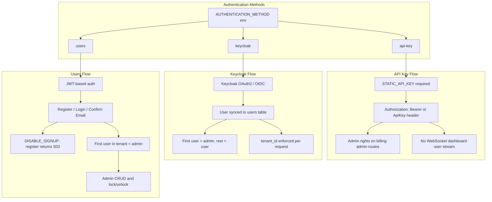

# Authentication

Authentication system supporting multiple methods with configurable user registration for the billing console and billing manager API.

## Overview

Decabill supports three authentication methods:

- **API Key Authentication** Static API key for automation and operator scripts
- **Keycloak Authentication** OAuth2/OIDC via Keycloak
- **Users Authentication** Built-in user registration with JWT

Each method is configured via environment variables on the billing manager. The billing console runtime config must match the backend method.

## Authentication Methods

### API Key Authentication

Simple authentication using a static API key. Suitable for automation, CI, and single-operator deployments.

**Configuration**:

```bash
AUTHENTICATION_METHOD=api-key
STATIC_API_KEY=your-secure-api-key-here
```

When `STATIC_API_KEY` is set and `AUTHENTICATION_METHOD` is unset, the backend may infer api-key mode. See [Security - Operational hardening](../security/operational-hardening.md) for resolution behavior.

**Features**:

- All requests require `Authorization: Bearer <key>` or `Authorization: ApiKey <key>` header
- API key authentication grants admin rights on billing admin routes
- No interactive user identity; WebSocket dashboard status is rejected (see [Real-time Status](./real-time-status.md))
- Combine with [Multi-tenancy](./multi-tenancy.md) and optional `STATIC_API_KEY_TENANT_ID`

### Keycloak Authentication

Enterprise-grade authentication using Keycloak OAuth2/OIDC.

**Configuration**:

```bash
AUTHENTICATION_METHOD=keycloak
KEYCLOAK_AUTH_SERVER_URL=http://localhost:8380
KEYCLOAK_REALM=decabill
KEYCLOAK_CLIENT_ID=billing-manager
KEYCLOAK_CLIENT_SECRET=your-client-secret
```

**Features**:

- OAuth2/OIDC authentication flow in the billing console
- Users are synced to the local `users` table
- First synced user gets admin role, subsequent users get user role
- Integration with existing identity providers and MFA via Keycloak
- Per-user `tenant_id` enforced by [Multi-tenancy](./multi-tenancy.md)

### Users Authentication

Built-in user registration and authentication with JWT tokens.

**Configuration**:

```bash
AUTHENTICATION_METHOD=users
JWT_SECRET=your-jwt-secret-key
DISABLE_SIGNUP=false
```

**Features**:

- User registration with email and password
- Email confirmation with 6-character alphanumeric codes
- Password reset functionality
- JWT-based authentication (7-day expiry)
- First registered user gets admin role
- Admin user management (CRUD, lock, unlock)
- Optional signup disable for controlled onboarding
- **Personal access tokens (PATs)** for machine/API automation (see below)

### Personal access tokens (users and keycloak modes)

User-bound tokens for scripts and CI (for example usage recording). They are **not** a billing-console login password. **Not available** when `AUTHENTICATION_METHOD=api-key`.

| Concern                  | Behavior                                                                                                                                                   |
| ------------------------ | ---------------------------------------------------------------------------------------------------------------------------------------------------------- |
| Create / update / revoke | Console **Personal Access Tokens** page (`/settings/tokens`); interactive console session only (password JWT or Keycloak OIDC)                             |
| Exchange                 | `POST /auth/token` with `{ "token": "fp_pat_…" }` only (no email) → JWT with `amr: ["pat"]` and `scopes`                                                   |
| Console                  | Login rejects `fp_pat_` secrets; SPA rejects JWTs whose `amr` includes `pat`; dashboard WebSockets reject PAT JWTs                                         |
| Keycloak                 | Local `users` row is synced on first authenticated request (`keycloakSub`); PAT CRUD and exchange require `JWT_SECRET`                                     |
| Scopes                   | `BILLING_PAT_SCOPES` covers catalog/subscriptions/invoices/usage/projects/tickets/… + `users:admin` / `webhooks:admin`; each enforced via `@RequireScopes` |

Prefer PATs over a shared `STATIC_API_KEY` for multi-tenant automation (see accepted risk DR-002).

Updating a token changes **name** and **scopes** only; the secret is never rotated by update. Exchanged PAT JWTs embed `patId`; each request re-checks the PAT row so **revoke**, **expiry**, and **scope updates** take effect immediately. **Role demotion** also takes effect immediately: request roles come from the live DB user (not the JWT claim), admin-only scopes are stripped from the effective grant set, and changing a user’s role bumps `tokenVersion` so outstanding JWTs are rejected.

## Users Authentication Flow

### Registration

1. User registers with email and password
2. System checks if signup is enabled (`DISABLE_SIGNUP`)
3. If signup is disabled, registration returns 503 Service Unavailable
4. If enabled, user account is created in the current tenant (from `X-Tenant`):
   - First user in the tenant: auto-confirmed and assigned admin role
   - Subsequent users: receive confirmation code via email (queued delivery; see [Email notifications](./email-notifications.md))

### Email Confirmation

1. User receives confirmation code via email
2. User submits email and code on the confirmation page
3. System validates code and confirms email
4. User can log in

If the confirmation page was closed before the code was entered, the confirmation email explains how to continue: sign in again with the same email address (the app returns to the confirmation page), or open `/confirm-email` and enter the email address with the code manually.

### Login

1. User enters email and password
2. System validates credentials and tenant scope
3. System checks email confirmation and account lock state
4. JWT token is issued and stored client-side
5. Token is included in subsequent HTTP and WebSocket requests

When credentials are valid but the email is not confirmed yet, login returns `401` with code `EMAIL_NOT_CONFIRMED` and the frontend redirects to `/confirm-email` with the email pre-filled.

### Password Reset

1. User requests password reset with email
2. System sends 6-character alphanumeric reset code via email
3. User submits email, code, and new password
4. System validates code and updates password

## Disabling Signup

When `DISABLE_SIGNUP=true`:

- `POST /auth/register` returns 503 with message "Signup is disabled"
- Admin user creation via `POST /users` remains available
- Billing console hides "Create an account" and redirects `/register` to login

Frontend runtime config should set `authentication.disableSignup` to match the backend.

## User Roles

### Admin Role

- Full access to billing admin routes under `/admin/billing/*`
- User management (create, read, update, delete, lock, unlock)
- Service type and service plan administration
- Manual invoice and customer profile administration

### User Role

- Standard customer access: subscriptions, invoices, customer profile
- Cannot access admin routes
- Can change own password and update own profile

## Security Features

### Password Security

- Passwords hashed with bcrypt
- Minimum password length enforced
- Password confirmation required on registration

### Token Security

- JWT tokens expire after 7 days
- Tokens include user ID, email, role, and a token version (`tv`) claim
- Each request verifies the user still exists, is not locked, and that the JWT token version matches `token_version` in the database
- **Logout** (`POST /auth/logout`) revokes the current JWT session by default; optional `invalidateAllSessions: true` ends every session
- **Password change** increments `token_version` and returns a new JWT for the current browser; other sessions fail on their next request
- **Password reset** and **admin password updates** increment `token_version`; affected users must log in again
- Keycloak mode: session lifecycle is managed by Keycloak (optional "logout other sessions" in Keycloak password UI)
- Keycloak mode applies the same lock check against the synced local user row
- SPA HTTP interceptor dispatches logout on 401 with session-ending messages

### Rate Limiting

- Authentication endpoints are rate-limited
- Prevents brute force attacks

## API Endpoints

### Authentication Endpoints (Public)

- `POST /auth/login` - Login with email and password (console; PATs rejected)
- `POST /auth/token` - Exchange personal access token for machine JWT (`amr: pat`)
- `POST /auth/register` - Register new user (503 when signup disabled)
- `POST /auth/confirm-email` - Confirm email with code
- `POST /auth/request-password-reset` - Request password reset
- `POST /auth/reset-password` - Reset password with code
- `POST /auth/change-password` - Change password (authenticated; returns new JWT)
- `POST /auth/logout` - Log out and invalidate all JWT sessions (users auth only)

### Personal Access Token Endpoints (Password session)

- `GET /auth/token-scopes` - Grantable scopes for the current user
- `GET /auth/tokens` - List own tokens
- `POST /auth/tokens` - Create token (plaintext returned once)
- `PATCH /auth/tokens/{id}` - Update own token name and scopes (secret unchanged)
- `DELETE /auth/tokens/{id}` - Revoke own token
- `GET /users/{userId}/tokens` - List tokens for a user (admin)
- `DELETE /users/{userId}/tokens/{tokenId}` - Revoke a user's token (admin)

### User Management Endpoints (Admin Only)

- `GET /users` - List users
- `POST /users` - Create user
- `GET /users/{id}` - Get user
- `POST /users/{id}` - Update user
- `DELETE /users/{id}` - Delete user
- `POST /users/{id}/lock` - Lock user account
- `POST /users/{id}/unlock` - Unlock user account

See [Billing Manager OpenAPI](/spec/billing-manager/openapi.yaml) for request and response schemas.

## Authentication Flow Diagram



## Related documentation

- **[Multi-tenancy](./multi-tenancy.md)** Tenant header and API key scope
- **[Environment Configuration](../deployment/environment-configuration.md)** Environment variable reference
- **[Security (Accepted risks)](../security/accepted-risks.md)** Authentication and tenant scope entries
- **[Backend Billing Manager](../applications/backend-billing-manager.md)** Backend authentication implementation
- **[Frontend Billing Console](../applications/frontend-billing-console.md)** Frontend authentication UI

---

_For detailed API specifications, see [Billing Manager OpenAPI](/spec/billing-manager/openapi.yaml)._
