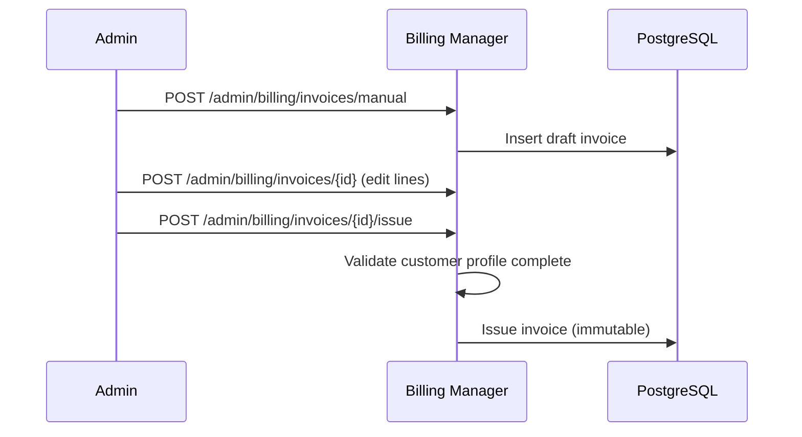

# Billing Administration

Admin-only features in the billing console for manual invoice management, customer billing profile CRUD, operational dashboards, and bill-now.

See also: [API Reference](../api-reference/README.md) for the published OpenAPI and AsyncAPI specifications.

## Access Control

All endpoints under `/admin/billing/*` require admin role (`@KeycloakRoles(ADMIN)` + `@UsersRoles(ADMIN)`). Frontend routes use `authGuard` + `billingAdminGuard`.

**Multi-tenancy:** Admin and user routes are scoped by **`X-Tenant`** and the user's **`tenant_id`**. API key auth with **`STATIC_API_KEY`** and without **`STATIC_API_KEY_TENANT_ID`** can administer **all** configured tenants (accepted risk **[DR-002](../security/accepted-risks.md#dr-002-billing-multi-tenant-api-key-scope-static_api_key_tenant_id-unset)**).

## Billing Dashboard

**Frontend route:** `/administration/billing`

Split layout with dashboard cards and charts on the left, invoice list on the right.

### KPIs and Statistics

| Method | Path                                   | Purpose                                           |
| ------ | -------------------------------------- | ------------------------------------------------- |
| GET    | `/admin/billing/summary`               | High-level billing summary                        |
| GET    | `/admin/billing/statistics/summary`    | Aggregated statistics                             |
| GET    | `/admin/billing/statistics/by-product` | Breakdown by plan or project (Unknown if neither) |
| GET    | `/admin/billing/statistics/by-country` | Breakdown by buyer country                        |

### Invoice Lists

| Method | Path                                   | Purpose                   |
| ------ | -------------------------------------- | ------------------------- |
| GET    | `/admin/billing/invoices`              | Paginated invoice list    |
| GET    | `/admin/billing/invoices/open-overdue` | Open and overdue invoices |

The invoice list supports batch loading with client-side search in list-group style.

### Bill Now

`POST /admin/billing/bill-now` triggers immediate invoice generation for selected users, bypassing the billing-day scheduler when operators need on-demand billing. It uses the same accumulated-invoice path as the billing-day job: if the payable total is below `BILLING_MIN_CHECKOUT_PAYMENT_AMOUNT`, open positions are left unbilled for the next billing day.

## Admin Subscriptions

**Frontend route:** `/administration/subscriptions`

| Method | Path                                               | Purpose                                                 |
| ------ | -------------------------------------------------- | ------------------------------------------------------- |
| GET    | `/admin/billing/subscriptions`                     | Paginated subscription list                             |
| POST   | `/admin/billing/subscriptions/{id}/cancel`         | Schedule cancel (same policy as customer)               |
| POST   | `/admin/billing/subscriptions/{id}/withdraw`       | Statutory withdraw when eligible                        |
| POST   | `/admin/billing/subscriptions/{id}/instant-cancel` | Force instant removal (bypasses cancel/Widerruf policy) |
| POST   | `/admin/billing/subscriptions/{id}/resume`         | Resume pending cancel                                   |

Instant cancel marks `instantRemoval` and queues `subscription-instant-cancel` jobs. See [Subscriptions — Admin instant cancel](./subscriptions.md#admin-instant-cancel).

## Manual Invoice Administration

**Immutability:** Only invoices in `draft` status can be edited or deleted. Once issued (`issued`, `paid`, `partially_paid`, `overdue`, or `void`), line items and amounts are immutable. Admins can still void unpaid issued invoices or mark payment status manually.

**Workflow:**

1. `POST /admin/billing/invoices/manual` - Create draft with user, optional subscription, custom line items
2. `POST /admin/billing/invoices/{invoiceRefId}` - Update draft line items
3. `POST /admin/billing/invoices/{invoiceRefId}/issue` - Issue draft (requires complete customer profile)
4. `DELETE /admin/billing/invoices/{invoiceRefId}` - Delete draft only

Additional admin actions on issued invoices:

- `POST /admin/billing/invoices/{invoiceRefId}/void` - Void invoice
- `POST /admin/billing/invoices/{invoiceRefId}/mark-paid` - Mark paid manually
- `POST /admin/billing/invoices/{invoiceRefId}/mark-unpaid` - Revert paid status
- `GET /admin/billing/invoices/{invoiceRefId}/audit-logs` - Audit trail
- `GET /admin/billing/invoices/{invoiceRefId}/pdf` - Download PDF
- `GET /admin/billing/invoices/{invoiceRefId}/void-document/pdf` - Void document PDF

## Customer Billing Profiles (Admin)

Customer billing data is stored in `billing_customer_profiles` (one profile per user).

| Method | Path                                                          | Purpose                                                |
| ------ | ------------------------------------------------------------- | ------------------------------------------------------ |
| GET    | `/admin/billing/customer-profiles`                            | Paginated list                                         |
| GET    | `/admin/billing/customer-profiles/{id}`                       | Full profile detail (includes encrypted `customData`)  |
| POST   | `/admin/billing/customer-profiles/{id}/data`                  | Add custom data key (409 if exists)                    |
| POST   | `/admin/billing/customer-profiles/{id}/data/{key}`            | Update custom data value (404 if missing)              |
| DELETE | `/admin/billing/customer-profiles/{id}/data/{key}`            | Delete custom data key (404 if missing)                |
| GET    | `/admin/billing/customer-profiles/{id}/trust-score`           | Recomputed trust score detail                          |
| POST   | `/admin/billing/customer-profiles/{id}/trust-score/recompute` | Force trust recompute                                  |
| POST   | `/admin/billing/customer-profiles`                            | Create for user                                        |
| POST   | `/admin/billing/customer-profiles/{id}`                       | Update                                                 |
| DELETE | `/admin/billing/customer-profiles/{id}`                       | Delete (blocked if user has invoices or subscriptions) |

Self-service `GET/POST /customer-profile` remains for end users and **never** returns `customData`. See [Customer Profiles](./customer-profiles.md).
Trust ranking remains admin-only. See [Customer Trust Score](./customer-trust-score.md).

**Frontend:** `/administration/customer-profiles` in the billing console.

## Admin Projects

Projects are managed under `/admin/billing/projects`. Admins assign each project to a customer user, track time, and bill unbilled hours to an invoice.

| Method | Path                                                       | Purpose                                     |
| ------ | ---------------------------------------------------------- | ------------------------------------------- |
| GET    | `/admin/billing/projects`                                  | Paginated list (`search`, `userId` filters) |
| POST   | `/admin/billing/projects`                                  | Create project                              |
| POST   | `/admin/billing/projects/{projectId}`                      | Update project                              |
| DELETE | `/admin/billing/projects/{projectId}`                      | Delete (no unbilled time)                   |
| GET    | `/admin/billing/projects/{projectId}/unbilled-time-bounds` | Default bill-time range                     |
| POST   | `/admin/billing/projects/{projectId}/bill-time`            | Issue invoice from unbilled time in range   |

**Frontend:** `/administration/projects`

See **[Projects](./projects.md)** for assignment rules, KPIs, and bill-time preconditions.

## Webhook Notifications

Admin and API-key clients manage tenant-scoped webhook endpoints under `/admin/billing/webhooks`.

| Method | Path                                      | Purpose                                           |
| ------ | ----------------------------------------- | ------------------------------------------------- |
| GET    | `/admin/billing/webhooks/event-types`     | Supported billing event catalog                   |
| GET    | `/admin/billing/webhooks`                 | List endpoints for current tenant                 |
| POST   | `/admin/billing/webhooks`                 | Create endpoint (returns one-time signing secret) |
| GET    | `/admin/billing/webhooks/{id}`            | Get endpoint                                      |
| POST   | `/admin/billing/webhooks/{id}`            | Update endpoint                                   |
| DELETE | `/admin/billing/webhooks/{id}`            | Delete endpoint                                   |
| POST   | `/admin/billing/webhooks/{id}/test`       | Send sample event                                 |
| GET    | `/admin/billing/webhooks/{id}/deliveries` | Paginated delivery log                            |

**Frontend:** `/webhooks` in the billing console (admin only).

See **[Webhooks](./webhooks.md)** for payload envelope, signing, and event types.

## Related documentation

- **[Dashboard and server control](./dashboard-and-server-control.md)** Billing dashboard KPIs, charts, and bill-now (`/administration/billing`)
- **[Customer profiles](./customer-profiles.md)** Admin customer profile CRUD (`/administration/customer-profiles`)
- **[Customer trust score](./customer-trust-score.md)** Admin-only traffic-light ranking inside customer profiles
- **[Projects](./projects.md)** Admin project CRUD and bill-time (`/administration/projects`)
- **[Webhooks](./webhooks.md)** Tenant-scoped outbound notification endpoints (`/webhooks`)
- **[Service types and plans](./service-types-and-plans.md)** Catalog administration in the billing console
- **[Authentication](./authentication.md)** Shared identity user manager (`/users`)
- **[Invoices](./invoices.md)** Status model and open positions
- **[Multi-tenancy](./multi-tenancy.md)** Tenant scope and DR-002
- **[Billing Manager OpenAPI](/spec/billing-manager/openapi.yaml)** Full admin path schemas

---

_For manual invoice diagrams, see the billing manager feature module documentation._
