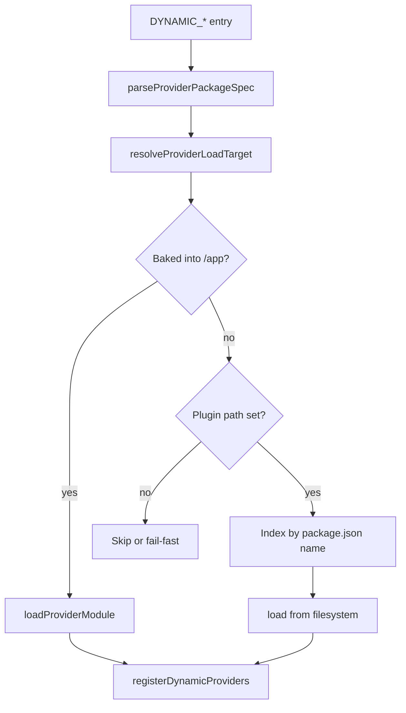

# Dynamic Provider Plugins

Extend the billing manager with extra payment processors and billing UI provider metadata at runtime without forking the application image.

## Overview

Decabill uses the shared `@forepath/shared/backend/util-dynamic-provider-registry` loader. Provider packages can be **baked into** the billing manager deploy graph or **mounted post-build** into `DYNAMIC_PROVIDER_PLUGIN_PATH`.

This page covers **Decabill billing manager** registries only.

## Registries

| Env var                             | Criticality | Registers                                                                                                                                                                       |
| ----------------------------------- | ----------- | ------------------------------------------------------------------------------------------------------------------------------------------------------------------------------- |
| `DYNAMIC_PAYMENT_PROCESSORS`        | critical    | Payment processor implementations                                                                                                                                               |
| `DYNAMIC_BILLING_PROVIDER_METADATA` | optional    | Admin UI provider metadata (`providerMetadata` export)                                                                                                                          |
| `DYNAMIC_BILLING_PROVIDER_MODULES`  | optional    | Runtime provider modules (`collectMeters`, optional `provision` / lifecycle / catalog hooks, `jobs`, `migrations`, optional `nestModule`) — distinct from metadata-only plugins |
| `DYNAMIC_ADDON_MODULES`             | optional    | Addon lifecycle modules (`provision` / `teardown` / optional `collectMeters`, `configFields`, `meters`, `serviceTabs`, `jobs`, `migrations`, `nestModule`)                      |
| `DYNAMIC_INTEGRATED_STACK_MODULES`  | optional    | Integrated stack modules (`buildUserData` / `buildUpdateCommand` / `serviceTabs` / `jobs` / `migrations` / optional `nestModule`)                                               |
| `DYNAMIC_CLOUD_INIT_MODULES`        | optional    | CloudInit config code modules keyed by template `key` (`serviceTabs`, `jobs`, `migrations`, optional `nestModule`)                                                              |

Provider metadata capability flags (all **fail closed** when omitted, treated as `false`):

| Flag                          | When to set `true`                                    |
| ----------------------------- | ----------------------------------------------------- |
| `supportsAddons`              | Provider has addon hook points (module or cloud-init) |
| `supportsServerTypeUpgrade`   | In-place resize to a more expensive server type works |
| `supportsServerTypeDowngrade` | In-place resize to a cheaper server type works        |

See [Addons](./addons.md) and [Subscription Config Change](./subscription-config-change.md). Operators shipping dynamic providers must set the resize flags explicitly; built-in Hetzner/DigitalOcean already register both.

Addon modules may declare `configFields` (CloudInit-style env metadata). Decabill persists that list onto the catalog addon’s `configSchema` at create/update; admins set encrypted defaults only. At order time, customer `addonConfigs` merge with defaults and random fills into `configSnapshot` for `provision` / `teardown`.

### Declared meters and collection

- Metadata packages (`DYNAMIC_BILLING_PROVIDER_METADATA`) and addon modules may declare `meters` (including optional `collectionIntervalMs`) for catalog sync.
- Runtime **provider modules** (`DYNAMIC_BILLING_PROVIDER_MODULES`, plus first-party Hetzner/DigitalOcean contributor modules) implement `collectMeters(ctx)` and may also declare `meters` (runtime overrides metadata for the same key when resolving intervals). Modules with `provision` are routed through `ProvisioningDispatchService`.
- Addon modules may implement optional `collectMeters` for meters with `collectionIntervalMs`.
- See [Usage meters](./usage-meters.md) for the meter-collect BullMQ job.

### Contributor jobs and plugin migrations

Addon, integrated-stack, CloudInit, and **provider** **code** modules may declare:

- `jobs?: ContributorJobDefinition[]` — periodic worker work (`key` slug, `intervalMs` 15s–24h, optional `isEnabled`, `run({ tenantId, now, source, sourceKey })`). Duplicate `(source, sourceKey, key)` and reserved keys (`coordinator`, `unit`) are rejected at register time.
- `migrations?: Array<new () => MigrationInterface>` — extra SQL applied **after** host TypeORM migrations on `QUEUE_ROLE=api|all`. Recorded in TypeORM’s `migrations` table as `plugin__{source}__{sourceKey}__{ClassName}`. Fail closed on error; SQL is never logged.

Plugin **entity classes** are not injected into TypeORM `forRoot` (frozen before Nest `onModuleInit`). Plugins persist with SQL they migrate, or reuse first-party tables. Same trust boundary as `DYNAMIC_ADDON_MODULES` (operator-deployed packages).

### Contributor Nest modules (`nestModule`)

Addon, integrated-stack, CloudInit, and **provider** **code** packages may also export a Nest `@Module` class as **`nestModule`**, plus **`contributorKey`** (or an env alias such as `acme-ops=@pkg`). The API and worker load those classes **before** `NestFactory.create` (`AppModule.register` / `BillingModule.withContributors`) so controllers and `@WebSocketGateway()` providers register like first-party code.

First-party **provisioning providers** (Hetzner, DigitalOcean) and **integrated stacks** (Agenstra Controller, Agenstra Manager, Decabill Billing) are contributor Nest modules. Providers register metadata and runtime hooks at `onModuleInit`; stacks register `IntegratedStackModule` with **`buildUserData`**. `ProvisioningDispatchService` and `CloudInitDispatchService` resolve registered modules by id/key at runtime; missing hooks fail closed. Operator `DYNAMIC_BILLING_PROVIDER_MODULES` / `DYNAMIC_INTEGRATED_STACK_MODULES` packages can ship full products the same way (`createProvider` with hooks, optional `nestModule`).

**Fail closed path allowlist** (normalized, no leading slash). Only these prefixes are accepted, with `{sourceKey}` matching the contributor key slug:

- `subscriptions/:subscriptionId/items/:itemId/{sourceKey}`
- `admin/billing/subscriptions/:subscriptionId/items/:itemId/{sourceKey}`
- `contributor/{source}/{sourceKey}` where `{source}` is `addon`, `integrated`, `cloud-init`, or `provider`
- `admin/billing/contributor/{source}/{sourceKey}`

Duplicate `(source, sourceKey)` or duplicate controller paths are rejected at register time. Plugin routes are **not** auto-merged into first-party `openapi.yaml`. Global `TenantUserGuard` still applies; plugin controllers must declare `@RequireScopes` and admin role decorators.

Angular UI cannot load unknown bundles at runtime (no Module Federation). Contributor tabs, extra routes, NgRx, and nav entries are **compile-time** (`FIRST_PARTY_CONTRIBUTOR_UI_MODULES` in the billing console). There is no `DYNAMIC_FRONTEND_*`.

See [Service details](./service-details.md) and [Container Manager](./container-manager.md).

Dispatcher (not one BullMQ job name per plugin):

| Variable                               | Purpose                                                                         |
| -------------------------------------- | ------------------------------------------------------------------------------- |
| `BILLING_CONTRIBUTOR_COLLECT_ENABLED`  | Default `true`; set `false` to disable the coordinator                          |
| `BILLING_CONTRIBUTOR_COLLECT_INTERVAL` | Coordinator tick ms (default `30000`); each job still uses its own `intervalMs` |

See [Service details](./service-details.md) and [Container Manager](./container-manager.md).

Shared tuning:

| Variable                          | Purpose                                                       |
| --------------------------------- | ------------------------------------------------------------- |
| `DYNAMIC_PROVIDERS_FAIL_FAST`     | When `true`, critical registries abort startup on load errors |
| `DYNAMIC_PROVIDER_PLUGIN_PATH`    | Absolute plugin root inside the container                     |
| `DYNAMIC_PROVIDER_PLUGIN_INSTALL` | Comma-separated `npm install` targets at startup              |

**Production:** set `DYNAMIC_PROVIDERS_FAIL_FAST=true` when `DYNAMIC_PAYMENT_PROCESSORS` is non-empty.

## Resolution Order

For each `DYNAMIC_*` entry the loader:

1. **Baked-in** resolves the package from `/app/package.json` (image build graph)
2. **Plugin path** looks up the package by `package.json` name under `DYNAMIC_PROVIDER_PLUGIN_PATH`
3. **Fail** logs and skips, or aborts startup when critical and fail-fast is enabled

Baked-in wins when the same package exists in both places.



## Config Format

```bash
# alias=@package/specifier
DYNAMIC_PAYMENT_PROCESSORS=acme=@forepath/decabill/backend/payment-acme

# PascalCase alias selects named class export
DYNAMIC_BILLING_PROVIDER_METADATA=AcmeMeta=@forepath/decabill/backend/billing-provider-acme

# bare specifier
DYNAMIC_PAYMENT_PROCESSORS=@forepath/decabill/backend/payment-acme

# file: entry relative to plugin path
DYNAMIC_PAYMENT_PROCESSORS=acme=file:payment-acme
```

Allowed package name prefixes: `@forepath/`, `@decabill/`. Do not combine `file:` with an `@forepath/` specifier on the same entry.

## Plugin Package Contract

External packages must export one of:

1. **`createProvider`** (preferred) - `(moduleRef: ModuleRef) => T | Promise<T>`
2. **Named PascalCase class** via entry alias or `package.json`:

```json
{
  "forepath": {
    "providerExport": "AcmePaymentProcessor"
  }
}
```

Contributor packages (addons / stacks / CloudInit) may additionally export **`nestModule`** (a Nest `@Module` class) and **`contributorKey`**. `createProvider` is not required when the package only ships HTTP.

For billing UI metadata packages, export **`providerMetadata`** array compatible with the provider registry service.

Declare Nest and host dependencies as **peerDependencies** resolved from `/app/node_modules`.

## Payment Processors

Processors implement the `PaymentProcessor` interface:

- Register with `PaymentProcessorFactory` at module bootstrap
- Handle checkout session creation and webhook processing for their provider
- Expose a unique `type` string matching `BILLING_DEFAULT_PAYMENT_PROCESSOR`
- Implement `supportsAutoPayment()` (`false` unless off-session charging is supported)
- When auto-payment is supported, implement `createSetupSession` and `chargeOffSession`

Built-in: `stripe` via `StripePaymentProcessor`. See [Payment Processing](./payment-processing.md) and [Auto-Billing](./auto-billing.md).

## Billing Provider Metadata

`DYNAMIC_BILLING_PROVIDER_METADATA` adds entries to `GET /service-types/providers` for admin UI dropdowns and config schema rendering without implementing full provisioning in the same package.

Optional `providerMetadata.meters` (and the same field on `ProviderDetail`) declares required usage meters. On service-type create/update, Decabill ensures catalog rows by `key` and sideloads them onto `billing_service_type_meters` as non-removable (`source=provider`, `required=true`). Products that register via the same metadata surface declare meters the same way. See [Usage meters](./usage-meters.md).

Addon modules registered via `DYNAMIC_ADDON_MODULES` may declare `meters` the same way; they sync onto `billing_addon_meters` as `source=module`, `required=true`.

Built-in Hetzner and DigitalOcean providers register statically when API tokens are present. They set `supportsAddons`, `supportsServerTypeUpgrade`, and `supportsServerTypeDowngrade` to `true`.

Dynamic metadata packages that implement (or wrap) in-place `changeServerType` must export the matching upgrade/downgrade flags. If both stay unset, mid-life server-type change stays disabled in eligibility/preview/submit even when other provider APIs work.

## Baked-in Plugins

1. Add the provider package to the billing manager deploy graph
2. Set the relevant `DYNAMIC_*` variable
3. Rebuild the container image

## Post-build Plugins

1. Build the plugin to compiled JS with `package.json`
2. Mount into `./provider-plugins/` (compose maps to `/var/lib/forepath/provider-plugins`) and/or set `DYNAMIC_PROVIDER_PLUGIN_INSTALL`
3. Set `DYNAMIC_PROVIDER_PLUGIN_PATH=/var/lib/forepath/provider-plugins`
4. Set `DYNAMIC_*` to reference package name or `file:` directory
5. Restart the container

Startup runs `install-provider-plugins.js` before `main.js` when the plugin path is set. Install failures fail container start.

## Startup Error Policy

| Registry criticality | `DYNAMIC_PROVIDERS_FAIL_FAST` | On load error      |
| -------------------- | ----------------------------- | ------------------ |
| optional             | any                           | Log and skip entry |
| critical             | unset / `false`               | Log and skip entry |
| critical             | `true`                        | Abort startup      |

## Security

- Package `name` in indexed `package.json` files must use allowlisted prefixes (`@forepath/`, `@decabill/`)
- `file:` paths resolve under `DYNAMIC_PROVIDER_PLUGIN_PATH` only; traversal outside the root is rejected
- Private registry installs require operator-supplied `.npmrc` or token mounts
- Plugin HTTP runs with worker/API process privilege (same `DYNAMIC_*` trust boundary)
- Contributor controller paths are allowlisted; plugins cannot bind `/invoices` or `/admin/billing`
- Global `TenantUserGuard` still applies; plugin controllers must use `@RequireScopes` / admin role decorators

## Docker Compose Example

```yaml
environment:
  DYNAMIC_PROVIDER_PLUGIN_PATH: /var/lib/forepath/provider-plugins
  DYNAMIC_PROVIDER_PLUGIN_INSTALL: ${DYNAMIC_PROVIDER_PLUGIN_INSTALL:-}
  DYNAMIC_PROVIDERS_FAIL_FAST: 'true'
volumes:
  - ./provider-plugins:/var/lib/forepath/provider-plugins
```

See [Docker Deployment](../deployment/docker-deployment.md).

## Related documentation

- **[Payment Processing](./payment-processing.md)** Stripe built-in processor
- **[Service Types and Plans](./service-types-and-plans.md)** Provider registry consumption
- **[Environment Configuration](../deployment/environment-configuration.md)** `DYNAMIC_*` reference
- **[Backend Billing Manager](../applications/backend-billing-manager.md)** Compose and env

---

_Implementation: `@forepath/shared/backend/util-dynamic-provider-registry`._
