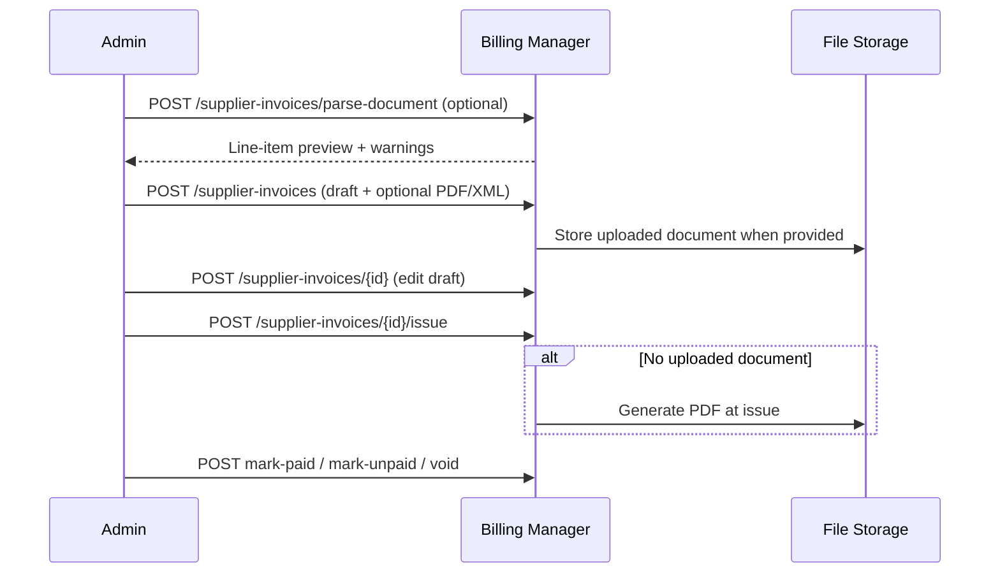

# Supplier Invoices (Accounts Payable)

Admin-only inbound expense invoices linked to [supplier profiles](./supplier-profiles.md). Supports manual entry, document upload, EN16931 XML parse preview, issue/void lifecycle, and DATEV AP booking export.

## Overview

Supplier invoices track money owed **to** vendors (AP), distinct from customer **AR** invoices under [Invoices](./invoices.md). They reuse the same status vocabulary (`draft`, `issued`, `paid`, `overdue`, `void`, etc.) but are stored in separate tables and numbered with `SINV-{year}-{nnnnn}`.

There is no customer-facing or Stripe checkout flow for supplier invoices.

## Access Control

All routes are under `/admin/billing/supplier-invoices` and require admin role plus PAT scopes:

| Operation                        | Scope                 |
| -------------------------------- | --------------------- |
| List, get, statistics, download  | `billing_admin:read`  |
| Create, update, issue, void, pay | `billing_admin:write` |

## Workflow

**Immutability:** Only `draft` invoices can be edited or deleted. Issued documents are immutable except for void and manual payment status changes.

### Typical Steps

1. **Parse (optional):** `POST /admin/billing/supplier-invoices/parse-document` with multipart field `document` (PDF or EN16931 XML). Returns preview line items and warnings; nothing is persisted.
2. **Create draft:** `POST /admin/billing/supplier-invoices` with supplier id, line items, optional dates, and optional `document` upload.
3. **Update draft:** `POST /admin/billing/supplier-invoices/{id}` — draft only; optional new document upload.
4. **Issue:** `POST /admin/billing/supplier-invoices/{id}/issue` — assigns invoice number, requires issue/due dates (on draft or in body). Generates PDF when no uploaded document exists.
5. **Payment / void:** `mark-paid`, `mark-unpaid`, or `void` on issued invoices.

## API Summary

| Method | Path                                                | Purpose                      |
| ------ | --------------------------------------------------- | ---------------------------- |
| GET    | `/admin/billing/supplier-invoices/statistics`       | Total gross + count (issued) |
| GET    | `/admin/billing/supplier-invoices`                  | Paginated list               |
| GET    | `/admin/billing/supplier-invoices/{id}`             | Detail with line items       |
| GET    | `/admin/billing/supplier-invoices/{id}/document`    | Download PDF                 |
| POST   | `/admin/billing/supplier-invoices/parse-document`   | Parse upload preview         |
| POST   | `/admin/billing/supplier-invoices`                  | Create draft                 |
| POST   | `/admin/billing/supplier-invoices/{id}`             | Update draft                 |
| POST   | `/admin/billing/supplier-invoices/{id}/issue`       | Issue draft                  |
| POST   | `/admin/billing/supplier-invoices/{id}/void`        | Void issued invoice          |
| POST   | `/admin/billing/supplier-invoices/{id}/mark-paid`   | Mark paid manually           |
| POST   | `/admin/billing/supplier-invoices/{id}/mark-unpaid` | Revert paid status           |
| DELETE | `/admin/billing/supplier-invoices/{id}`             | Delete draft only            |

List filters: `supplierId`, `status`, `search`, pagination.

## Document Sources

| Source      | When set                                   |
| ----------- | ------------------------------------------ |
| `uploaded`  | Operator attached PDF/XML at create/update |
| `generated` | System PDF created at issue when no upload |

Stored under the `supplier-invoices` file-storage scope (`FILE_STORAGE_ROOT` / S3 prefix).

## Tax Treatment

Line items use standard/reduced tax categories. Tax is computed from the **supplier country** and issuer configuration (same engine as AR invoices, inverted for AP expense accounts in DATEV). Snapshots are stored on the invoice at issue time.

## DATEV Export

Issued (and voided) supplier invoices are included in monthly DATEV Buchungsstapel exports alongside AR invoices. Bookings use **AP polarity** (haben on creditor account, expense account on soll). Creditor numbers are resolved per supplier via [Supplier profiles](./supplier-profiles.md).

Expense GL accounts and BU keys are configured per tenant (`BILLING_DATEV_EXPENSE_*`). See [Billing Administration — DATEV AP](./billing-administration.md#datev-accounts-payable).

## Webhook Events

- `supplier_invoice.created`, `supplier_invoice.issued`, `supplier_invoice.voided`, `supplier_invoice.marked_paid`, `supplier_invoice.marked_unpaid`, `supplier_invoice.document_uploaded`

Payloads include invoice id, supplier id, invoice number, status, and amounts — not full line-item detail or document paths.

## Related

- [Supplier profiles](./supplier-profiles.md)
- [Numbering](./numbering.md)
- [Webhooks](./webhooks.md)
- [Billing Administration](./billing-administration.md)
